# CHUNITHM 谱面文件格式说明

chunithm 是由 SEGA 开发的音乐游戏，本文档主要介绍 CHUNITHM 的谱面文件格式。

## 概念
:::warning
以下概念为笔者设定仅方便理解，不代表官方定义。
:::
我们约定：
- $W$为轨道宽度
- **\t** 为分割符
- $offset$ 为偏移量，单位为刻度数（tick），刻度数为谱面分辨率的倒数，即每小节的刻度总数，是时间计算的基础单位，通常为384

## 文件结构

CHUNITHM 的谱面文件通常是一个 `.c2s` 文件，其中包含谱面的详细信息。  
文件类似下所示（仅META部分，其他部分相同）：

```text
VERSION	1.11.00	1.11.00
MUSIC	0
SEQUENCEID	0
DIFFICULT	00
LEVEL	0.0
CREATOR	アミノハバキリ
BPM_DEF	199.000	199.000	199.000	199.000
MET_DEF	4	4
RESOLUTION	384
CLK_DEF	384
PROGJUDGE_BPM	240.000
PROGJUDGE_AER	  0.999
TUTORIAL	0
```
:::tip
每行代表一个字段，字段名和字段值之间用\t分割
:::

### META

- **VERSION** `String` `String`  
  游戏版本号，其中第一项和第二项相同，游戏只会使用第一项（需要验证）

- **MUSIC** `Int`  
  歌曲唯一标识符，在谱面文件中作用不明，通常为0，实际值在`music.xml`中定义

- **SEQUENCEID** `Int`  
  序列ID，作用不明，通常为0

- **DIFFICULT** `String`  
  谱面难度，作用不明，通常为00，实际值在`music.xml`中定义

- **LEVEL** `Float`  
  谱面等级，作用不明，通常为0.0，实际值在`music.xml`中定义

- **CREATOR** `String`  
  谱面创建者

- **BPM_DEF** `Float` `Float` `Float` `Float`  
  谱面 BPM 定义，第一项为谱面的起始 BPM，第二项作用不明，通常与第一项相同，第三项为谱面的最高 BPM，第四项为谱面的最低 BPM

- **MET_DEF** `Int` `Int`  
  谱面默认拍号，第一项分子（每小节几拍），第二项分母（以几分音符为一拍）`4` `4` 即常见的 4/4 拍
  :::warning
  MET_DEF 的字段顺序是 分子 分母，但谱面中的 MET 事件顺序是 分母 分子（历史原因）。
  :::

- **RESOLUTION** `Int`  
  谱面分辨率，每小节的刻度总数，是时间计算的基础单位，通常为384
  :::tip
  4/4 拍、分辨率 384 时：
    每拍 = 384 ÷ 4 = 96 ticks
    第 1 拍偏移 = 0
    第 2 拍偏移 = 96
    第 3 拍偏移 = 192
    第 4 拍偏移 = 288
  :::

- **CLK_DEF** `Int`  
   时钟定义，作用不明，实际上游戏并不会使用这个值，推测为历史遗留，通常为384，和谱面分辨率相同

- **PROGJUDGE_BPM** `Float`  
  渐进判定 BPM（`ProgJudge`可能是`Progressive Judge`），作用不明，通常为240.000

- **PROGJUDGE_AER** `Float`  
  渐进判定 AER（`ProgJudge`可能是`Progressive Judge`），作用不明，通常为0.999，实际文件中值前面可能有空格（如\t 0.999），解析时会自动去除。与 PROGJUDGE_BPM 配套使用

- **TUTORIAL** `Int`  
  标记该谱面是否为教程曲目，0表示不是，非0表示是
  :::tip
  教程曲目会有特殊的游戏引导（中二企鹅），提示玩家按哪里、怎么操作等。
  :::

### EVENTS
- **BPM** `Int` `Int` `Float`  
  格式：`BPM\tmeasure\toffset\tbpm`  
  BPM 事件，第一项为开始生效的小节号，第二项为小节内偏移量，第三项为 BPM 值

- **MET** `Int` `Int` `Int` `Int`  
  格式：`MET\tmeasure\toffset\tnum\tden`  
  MET 事件（Metronome），第一项为开始生效的小节号，第二项为小节内偏移量，第三项为分母，第四项为分子

- **SFL** `Int` `Int` `Int` `Float`  
  格式：`SFL\tmeasure\toffset\tlength\tspeed`  
  SFL 事件（Scroll Field Length）滚动区域长度，流速事件，第一项为开始生效的小节号，第二项为小节内偏移量，第三项为滚动区域长度 持续时间（按 resolution 计算），第四项为流速值
  :::warning
  文件中可能存在类似 END 的结束标签，可直接忽略它们，对谱面功能无影响。
  :::

### NOTES
- **TAP** `Int` `Int` `Int` `Int`  
  格式：`TAP\tmeasure\toffset\tcell\twidth`  
  TAP 音符，第一项为小节号，第二项为小节内偏移量，第三项为所在轨道，第四项为宽度
  :::tip
  轨道编号 0～15，宽度值为占用轨道数（1 = 一个轨道宽度），音符宽度 = $\frac{W}{16} \times$ 宽度
  :::
  

- **CHR** `Int` `Int` `Int` `Int` `String`  
  格式：`CHR\tmeasure\toffset\tcell\twidth\tanimation`  
  CHR 音符，第一项为小节号，第二项为小节内偏移量，第三项为所在轨道，第四项为宽度，第五项为打击后动画效果
  :::tip
  打击时必定判定为 CRITICAL JUSTICE，带有特殊动画效果。  
  UP 从下往上  
  DW 从上往下  
  CE 向判定面  
  LS 从右往左  
  RS 从左往右  
  LC 逆时针旋转  
  RC 顺时针旋转
  :::
  

- **HLD** `Int` `Int` `Int` `Int` `Int` `String`  
  格式：`HLD\tmeasure\toffset\tcell\twidth\tduration\tanimation` 或 `HLD\tmeasure\toffset\tcell\twidth\tduration`  
  HLD 音符，第一项为小节号，第二项为小节内偏移量，第三项为所在轨道，第四项为宽度，第五项为持续时间，第六项为打击后动画效果
  :::tip
  动画效果与 CHR 相同，若该项为None则无动画效果
  :::
  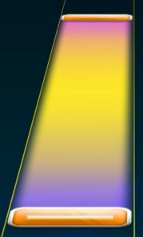

- **HXD** `Int` `Int` `Int` `Int` `Int` `String`  
  格式：`HXD\tmeasure\toffset\tcell\twidth\tduration\tanimation`  
  HXD 音符，第一项为小节号，第二项为小节内偏移量，第三项为所在轨道，第四项为宽度，第五项为持续时间，第六项为打击后动画效果
  :::tip
  动画效果与 CHR 相同，若该项为None则无动画效果

  HXD为 LUMINOUS 新增内容。与 HLD 格式完全相同，但头部为 ExTap（打击必 CRITICAL JUSTICE）。替代了旧版"CHR+HLD 叠加"的写法。
  :::
  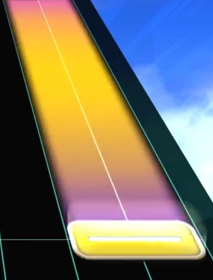

- **SLD** `Int` `Int` `Int` `Int` `Int` `Int` `Int` `String` `String`  
  格式：`SLD\tmeasure\toffset\tcell\twidth\tduration\tend_cell\tend_width\t\tanimation`  
  SLD 音符，第一项为小节号，第二项为小节内偏移量，第三项为起始所在轨道，第四项为起始宽度，第五项为持续时间，第六项为结束所在轨道，第七项为结束宽度，第八项作用不明，通常为""，第九项为打击后动画效果
  :::tip
  动画效果与 CHR 相同，若该项为None则无动画效果
  :::
  

- **SLC** `Int` `Int` `Int` `Int` `Int` `Int` `Int` `String` `String`   
  格式：`SLC\tmeasure\toffset\tcell\twidth\tduration\tend_cell\tend_width\t\tanimation`  
  SLC 为 SLD音符的控制点，不是一个音符，第一项为小节号，第二项为小节内偏移量，第三项为起始所在轨道，第四项为起始宽度，第五项为持续时间，第六项为结束所在轨道，第七项为结束宽度，第八项作用不明，通常为""，第九项为打击后动画效果
  :::tip
  动画效果与 CHR 相同，若该项为None则无动画效果
  :::  
  控制点无图片  
  :::tip SLD音符的基本组成
  起点	SLD	滑条开始位置，玩家需要打击并按住  
  控制点	SLC	滑条路径上的拐点，玩家改变移动方向  
  终点	最后一个 SLC 或 SLD	滑条结束位置，若结尾是 SLC 则末尾无蓝色音符，若结尾是 SLD 则末尾有蓝色音符
  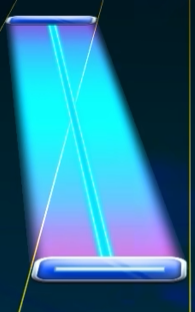
  :::

- **SXD** `Int` `Int` `Int` `Int` `Int` `Int` `Int` `String` `String`   
  格式：`SXD\tmeasure\toffset\tcell\twidth\tduration\tend_cell\tend_width\t\tanimation`  
  头部为 ExTap（打击必 CRITICAL JUSTICE）的 SLD音符，第一项为小节号，第二项为小节内偏移量，第三项为起始所在轨道，第四项为起始宽度，第五项为持续时间，第六项为结束所在轨道，第七项为结束宽度，第八项作用不明，通常为""，第九项为打击后动画效果
  :::tip
  动画效果与 CHR 相同
  :::
  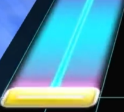

- **SXC** `Int` `Int` `Int` `Int` `Int` `Int` `Int` `String` `String`   
  格式：`SXC\tmeasure\toffset\tcell\twidth\tduration\tend_cell\tend_width\t\tanimation`  
  SXD 音符的控制点，不是一个音符，第一项为小节号，第二项为小节内偏移量，第三项为起始所在轨道，第四项为起始宽度，第五项为持续时间，第六项为结束所在轨道，第七项为结束宽度，第八项作用不明，通常为""，第九项为打击后动画效果
  :::tip
  动画效果与 CHR 相同
  :::
  :::tip SXD音符的基本组成
  与 SLD 音符相同，但头部为 ExTap（打击必 CRITICAL JUSTICE）  
  起点	SXD	滑条开始位置，玩家需要打击并按住  
  控制点	SXC	滑条路径上的拐点，玩家改变移动方向  
  终点	最后一个 SXC 或 SXD	滑条结束位置，若结尾是 SXC 则末尾无黄色音符，若结尾是 SXD 则末尾有黄色音符
  :::

- **FLK** `Int` `Int` `Int` `Int` `String`  
  格式：`FLK\tmeasure\toffset\tcell\twidth\tL`  
  FLK 音符，第一项为小节号，第二项为小节内偏移量，第三项为所在轨道，第四项为宽度，第五项作用不明，始终为`L`
  :::tip
  向任意方向滑动即可击中。第五项字段固定为L，不代表左右方向。
  :::
  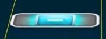

- **AIR** `Int` `Int` `Int` `Int` `String`  
  格式：`AIR\tmeasure\toffset\tcell\twidth\ttarget_note`
  AIR 音符，第一项为小节号，第二项为小节内偏移量，第三项为所在轨道，第四项为宽度，第五项为可依附的目标音符，必须是地面上的音符
  :::tip
  打击绑定的音符后立刻向上抬手。  
  target_note 为绑定的音符类型，其格式如`TAP`  
  到目前为止，未出现没有绑定地面音符的 AIR 音符
  :::
  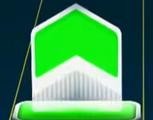

- **AUR** `Int` `Int` `Int` `Int` `String`  
  格式：`AUR\tmeasure\toffset\tcell\twidth\ttarget_note`
  AUR 音符，第一项为小节号，第二项为小节内偏移量，第三项为所在轨道，第四项为宽度，第五项为可依附的目标音符，必须是地面上的音符
  :::tip
  打击绑定的音符后立刻向右上方抬手。  
  target_note 为绑定的音符类型，其格式如`TAP`  
  到目前为止，未出现没有绑定地面音符的 AUR 音符
  :::
  

- **AUL** `Int` `Int` `Int` `Int` `String`  
  格式：`AUL\tmeasure\toffset\tcell\twidth\ttarget_note`
  AUL 音符，第一项为小节号，第二项为小节内偏移量，第三项为所在轨道，第四项为宽度，第五项为可依附的目标音符，必须是地面上的音符
  :::tip
  打击绑定的音符后立刻向左上方抬手。  
  target_note 为绑定的音符类型，其格式如`TAP`  
  到目前为止，未出现没有绑定地面音符的 AUL 音符
  :::
  

- **ADW** `Int` `Int` `Int` `Int` `String`  
  格式：`ADW\tmeasure\toffset\tcell\twidth\ttarget_note`
  ADW 音符，第一项为小节号，第二项为小节内偏移量，第三项为所在轨道，第四项为宽度，第五项为可依附的目标音符，必须是地面上的音符
  :::tip
  打击绑定的音符后立刻向下挥。  
  target_note 为绑定的音符类型，其格式如`TAP`  
  到目前为止，未出现没有绑定地面音符的 ADW 音符
  :::
  

- **ADR** `Int` `Int` `Int` `Int` `String`  
  格式：`ADR\tmeasure\toffset\tcell\twidth\ttarget_note`
  ADR 音符，第一项为小节号，第二项为小节内偏移量，第三项为所在轨道，第四项为宽度，第五项为可依附的目标音符，必须是地面上的音符
  :::tip
  打击绑定的音符后立刻向右下挥。  
  target_note 为绑定的音符类型，其格式如`TAP`  
  到目前为止，未出现没有绑定地面音符的 ADR 音符
  :::
  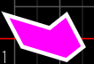

- **ADL** `Int` `Int` `Int` `Int` `String`  
  格式：`ADL\tmeasure\toffset\tcell\twidth\ttarget_note`
  ADL 音符，第一项为小节号，第二项为小节内偏移量，第三项为所在轨道，第四项为宽度，第五项为可依附的目标音符，必须是地面上的音符
  :::tip
  打击绑定的音符后立刻向左下挥。  
  target_note 为绑定的音符类型，其格式如`TAP`  
  到目前为止，未出现没有绑定地面音符的 ADL 音符
  :::
  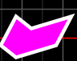

- **AHD** `Int` `Int` `Int` `Int` `String` `Int`  
  格式：AHD\tmeasure\toffset\tcell\twidth\ttarget_note\tduration  
  AHD 音符，第一项为小节号，第二项为小节内偏移量，第三项为所在轨道，第四项为宽度，第五项为可依附的目标音符，必须是地面上的音符，第六项为持续时间
  :::tip
  target_note 为绑定的音符类型，其格式如`TAP`  
  到目前为止，未出现没有绑定地面音符的 AHD 音符  
  该音符会在起点处显示一个 AIR 音符，然后在末尾处显示一个 ASD 音符
  :::
  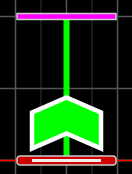

- **ASC** `Int` `Int` `Int` `Int` `String` `Float` `Int` `Int` `Int` `Float` `String`  
  格式：`ASC\tmeasure\toffset\tcell\twidth\ttarget_note\tstarting_height\tduration\tend_cell\tend_width\ttarget_height\tcolor`  
  ASC 音符，第一项为小节号，第二项为小节内偏移量，第三项为所在轨道，第四项为宽度，第五项为可依附的目标音符，必须是地面上的音符，第六项为起始高度，第七项为持续时间，第八项为结束所在轨道，第九项为结束宽度，第十项为结束高度，第十一项为颜色
  :::tip
  target_note 为绑定的音符类型，其格式如`TAP`  
  到目前为止，未出现没有绑定地面音符的 ASC 音符  
  该音符会在起点处显示一个 AIR 音符，并显示轨迹
  :::
  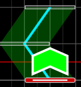

- **ASD** `Int` `Int` `Int` `Int` `String` `Float` `Int` `Int` `Int` `Float` `String`  
  格式：`ASD\tmeasure\toffset\tcell\twidth\ttarget_note\tstarting_height\tduration\tend_cell\tend_width\ttarget_height\tcolor`  
  ASD 音符，第一项为小节号，第二项为小节内偏移量，第三项为所在轨道，第四项为宽度，第五项为可依附的目标音符，必须是 ASC ASD 音符，第六项为起始高度，第七项为持续时间，第八项为结束所在轨道，第九项为结束宽度，第十项为结束高度，第十一项为颜色
  :::tip
  target_note 为绑定的音符类型，其格式如`ASC`  
  到目前为止，未出现没有绑定 ASC ASD 音符的 ASD 音符  
  :::
  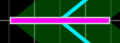

- **ALD** `Int` `Int` `Int` `Int` `Int` `Float` `Int` `Int` `Int` `Float` `String`  
  格式：`ALD\tmeasure\toffset\tcell\twidth\tinterval\tstarting_height\tduration\tend_cell\tend_width\ttarget_height\tcolor`
  ALD 音符，第一项为小节号，第二项为小节内偏移量，第三项为所在轨道，第四项为宽度，第五项为间隔，第六项为起始高度，第七项为持续时间，第八项为结束所在轨道，第九项为结束宽度，第十项为结束高度，第十一项为颜色
  :::tip
  其中`interval` 为间隔时间，单位和谱面分辨率相同  
  若该值为0，则表示一条装饰线，若该值不等于0，那么按照间隔生成紫色挥手音符。
  若该值为38400，则只会在开始时生成一个紫色挥手音符。
  :::
  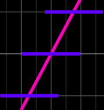