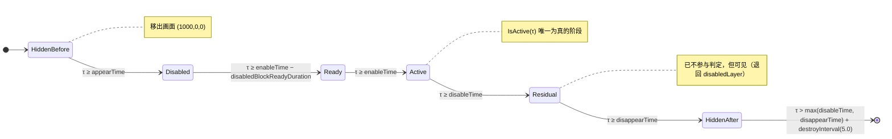

# BlockArea 运行时行为

本文档给出块系统的**全部运行时行为**：每帧执行顺序、几何、缓动、变换、阶段判定、
命中判定与音频。

除注明外，公式均取自 `libil2cpp.so` 的 ARM64 反汇编，常数已按 ELF 段映射逐字节校验。

::: warning 阅读前置
本文档使用的符号 **τ** / **p** / **P** / **H** / **S** 定义在
[`data.md` 符号约定](./data#符号约定)。数据结构与调参值也在 `data.md`。
:::

## 每帧执行顺序

反汇编 `PreviewBlockControl.Update()`（VA `0x1D7069C`）确认：

```csharp
void Update() {
    UpdateBlocksTransform();     // isDragging 时直接 return
    UpdateBlockActivation();
    UpdateBlockAnimations();     // isDragging 时直接 return
    DestroyAfterInterval();      // 尾调用
}
```

`UpdateBlockAnimations()` 内部（VA `0x1D7098C`）：

```csharp
void UpdateBlockAnimations() {
    if (isDragging) return;
    if (!IsTimeValid()) return;
    GetBlockGeometry(Vector2.one * 0.5f, out var geo);   // anchor = (0.5, 0.5)
    UpdateScale(...);            // → (sx, sy)
    UpdateRotation(...);         // → angle
    var pos = UpdateMovement(geo, scale, angle);
    transform.localPosition = pos;
    transform.localScale   = new Vector3(Mathf.Abs(sx), Mathf.Abs(sy), 1f);
    transform.eulerAngles = new Vector3(0, 0, angle);
}
```

三个要点：

- **执行序是 Scale → Rotation → Movement**，位置计算依赖已算出的缩放与旋转。
- `localScale` 的两个分量**取绝对值**，`z` 恒为 `1`。
- `isDragging` 为真时，变换更新**整段跳过**，块保持编辑器里手动拖好的位置。

::: tip `isDragging` 的真实含义
该字段**不是**「手指是否在移动」——按住不动时它同样为 `true`。它标记的是
**拖拽模式已激活**：按下手势被识别为拖拽（而非点击）后才置位，作用是抑制点击类判定。
:::

## 1 坐标转换

### 1.1 百分比 → 世界坐标

`PreviewBlockControl.AnchorToWorld` 全部逻辑仅 4 条指令：

```csharp
Vector2 AnchorToWorld(Vector2 anchor) {
    Vector2 screen = new Vector2(screenWidth, screenHeight);
    return new Vector2(
        (anchor.x - 0.5f) * screen.x,
        (anchor.y - 0.5f) * screen.y);
}
```

即**先把百分比中心化到 `0`，再乘世界视口尺寸**（`screenWidth/screenHeight` = `2·orthoSize·aspect` / `2·orthoSize`，`orthoSize = 5.0` 时约 `17.78 × 10`），结果以视口中心为原点。

### 1.2 块的摆放

`UpdateBlocksTransform()` 每帧执行，`isDragging` 为真时直接返回：

```csharp
float now = progressControl.nowTime;
if (blockInfo.appearTime > now || now >= blockInfo.disappearTime) {
    transform.localPosition = new Vector3(1000f, 0f, 0f);   // 移出画面
    return;
}

Vector2 bl = AnchorToWorld(blockInfo.bottomLeftPercentage);
Vector2 tr = AnchorToWorld(blockInfo.topRightPercentage);

transform.localPosition = new Vector3((bl.x + tr.x) * 0.5f, (bl.y + tr.y) * 0.5f, 0f);
transform.localScale    = new Vector3(Mathf.Abs(tr.x - bl.x), Mathf.Abs(tr.y - bl.y), 1f);
```

::: tip
块是**单位 quad 被缩放到目标矩形**。这解释了为什么命中判定的基准半边长恒为 `S / 2 = 0.5`。
:::

::: tip 隐藏态不切 layer
`HiddenBefore` / `HiddenAfter` 两个阶段不切换 layer，而是把 `localPosition`
移到 `(1000, 0, 0)` 移出画面。
:::

块的销毁条件：

```csharp
now > Mathf.Max(disappearTime, disableTime) + destroyInterval
```

## 2 时间与缓动

### 2.1 缓动类型表

游戏在启动时（`GetEase.Instantiation`）构造 **15 张**查找表，每张 **101 个采样点**
（`i = 0…100`，对应 `u = i / 100`）。

表内容全部由 `powf` 生成：

```csharp
// ── 主循环：idx 取 1, 4, 7, 10（每次 +3），指数 n = idx / 3 + 2（整数除法）
EaseInfos[idx]     = Mathf.Pow(i / 100f, n);                 // "in"
EaseInfos[idx + 1] = 1f - Mathf.Pow(1f - i / 100f, n);       // "out"
```

循环之后还有三段后处理（用 `j` 表示目标表内索引，勿与指数 `n` 混淆）：

```csharp
// 1) 对 EaseInfos[12] 做隔点降采样并压半
EaseInfos[12][j]      = EaseInfos[10][8 + 2j] * 0.5f;              // j = 0…49

// 2) 同法作用于覆盖度通道，再抬到 0.5~1.0 区间
EaseInfos[12][58 + j] = EaseInfos[11][8 + 2j] * 0.5f + 0.5f;       // j = 0…49

// 3) 末点归一
EaseInfos[12][100]    = 1f;

EaseInfos[13] = 0f;   // 全部置 0
EaseInfos[14] = 1f;   // 全部置 1
```

于是 `easeType 12` 在索引 `u = j / 100` 上的取值为：

| 索引区间 | 取值 |
| --- | --- |
| `0…46` | `EaseInfos[10][8 + 2j] × 0.5`，即 `pow(u, 5)` 的隔点降采样折半 |
| `47…49` | 同上式，但源索引 **102/104/106 越界** → 值为堆垃圾，见[下方警告](#缓动表采样点对照) |
| `50…57` | **未被任何语句写入** → 保持 `new float[101]` 的零值 |
| `58…99` | `(EaseInfos[11][8 + 2j] × 0.5) + 0.5` |
| `100` | `1.0` |

| easeType | 曲线 | 说明 |
| --- | --- | --- |
| `0` | `u` | 线性 |
| `1` | `u²` | in-quad |
| `2` | `1 − (1 − u)²` | out-quad |
| `3` | `0` | **未写入，恒为 0** |
| `4` | `u³` | in-cubic |
| `5` | `1 − (1 − u)³` | out-cubic |
| `6` | `0` | **未写入，恒为 0** |
| `7` | `u⁴` | in-quart |
| `8` | `1 − (1 − u)⁴` | out-quart |
| `9` | `0` | **未写入，恒为 0** |
| `10` | `u⁵` | in-quint |
| `11` | `1 − (1 − u)⁵` | out-quint |
| `12` | 见上（分段，含两处断点） | 降采样混合 |
| `13` | `0` | **恒为 0** |
| `14` | `1` | **恒为 1（瞬间到位）** |

::: warning easeType 12 存在两个「断点」
`50…57` 这 8 个采样点未被写入，保持为 `0`；而 `58` 处又出现 `0.5 + …` 的跳变。
查表使用线性插值，因此 `u` 落在 `0.49…0.58` 之间时该曲线会有可见的不连续。
官谱中 `easeType 12` 使用较少（move X 8 次、rotate 4 次），影响有限。
:::

### 缓动表采样点对照

下表由分析脚本 `tools/_gen_ease_table.py`（不随文档提供）从反汇编公式重建，
**5 个采样点全部重算吻合**。完整 101 点可用该脚本直接导出为 JSON。

::: warning 这不是「完整缓动表」，且 `easeType 12` 有 3 个点不可复现
初版称此表为「完整缓动表…15 × 101 个值全部通过恒等式校验，可直接用作复现时的对照表」。
**这是不准确的**，有两层问题：

1. 本表只列出 5 个采样点（`u = 0 / 0.25 / 0.5 / 0.75 / 1`），不是 101 个。
2. 校验只覆盖公式与端点，**没有做单调性或 `pow` 对称性检查**——
   初版声称校验了 `E[i-1] ≤ E[i] ≤ E[i+1]`，但 `E[12]` 本身非单调
   （见下表 `0.25 → 0.50` 从 `0.0328` 降到 `0.0000`），该断言不成立。
:::

| easeType | u=0.00 | u=0.25 | u=0.50 | u=0.75 | u=1.00 |
| --- | --- | --- | --- | --- | --- |
| `0` | 0.0000 | 0.2500 | 0.5000 | 0.7500 | 1.0000 |
| `1` | 0.0000 | 0.0625 | 0.2500 | 0.5625 | 1.0000 |
| `2` | 0.0000 | 0.4375 | 0.7500 | 0.9375 | 1.0000 |
| `3` | 0.0000 | 0.0000 | 0.0000 | 0.0000 | 0.0000 |
| `4` | 0.0000 | 0.0156 | 0.1250 | 0.4219 | 1.0000 |
| `5` | 0.0000 | 0.5781 | 0.8750 | 0.9844 | 1.0000 |
| `6` | 0.0000 | 0.0000 | 0.0000 | 0.0000 | 0.0000 |
| `7` | 0.0000 | 0.0039 | 0.0625 | 0.3164 | 1.0000 |
| `8` | 0.0000 | 0.6836 | 0.9375 | 0.9961 | 1.0000 |
| `9` | 0.0000 | 0.0000 | 0.0000 | 0.0000 | 0.0000 |
| `10` | 0.0000 | 0.0010 | 0.0312 | 0.2373 | 1.0000 |
| `11` | 0.0000 | 0.7627 | 0.9688 | 0.9990 | 1.0000 |
| `12` | 0.0000 | 0.0328 | 0.0000 | 0.9672 | 1.0000 |
| `13` | 0.0000 | 0.0000 | 0.0000 | 0.0000 | 0.0000 |
| `14` | 1.0000 | 1.0000 | 1.0000 | 1.0000 | 1.0000 |

::: danger `easeType 12` 的 `47`~`49` 三点越界读，且**会被采样**
`EaseInfor` 构造函数构建 `E[12]` 的两段降采样时：

| pass | 目标索引 | 源索引 |
| --- | --- | --- |
| 1（从 `E[10]`） | `j = 0…49` | `8 + 2j`，即最大 **106** |
| 2（从 `E[11]`） | `j = 58…107`→ 实际写入 `58…99` | `8 + 2j`，同样越界 |

`EaseInfos` 每项只有 101 个 float（合法索引 `0…100`），源索引 **102 / 104 / 106**
越界，读取的是相邻堆内存。`tools/_gen_ease_table.py` 的输出明确标注这三个槽位
**不可复现**（`NOT reproducible`）。

::: warning 初版「实际行为无影响」的推理是错的
初版称「查表时对 `i ≥ 100` 会被钳制，所以越界值永远取不到」。**这个推理不成立**：

- 钳制作用在**运行时查表**的下标 `i = progress × 100` 上；
- 越界发生在**构建期**，即写入 `E[12][47..49]` 时读取源表的 102/104/106。

因此 `E[12][47]`、`[48]`、`[49]` 三个值本身**是未定义的堆垃圾**，
且它们落在 `u ∈ [0.47, 0.50)` 区间——**这个区间会被正常采样**。

原版在这三个点的值无法在不运行游戏的情况下确定；按公式重建的实现
在这段区间会与原版不符。好在 `easeType 12` 在官谱中极少使用
（`move` X 方向 8 次、`rotate` 4 次），实际影响有限。
:::
:::

::: warning 这是原版的真实行为
`EaseInfor` 构造函数只做 `new float[101]`（零初始化），循环只覆盖索引 `1, 4, 7, 10` 及其后继，
因此 `3 / 6 / 9 / 13` **四种类型是死表**：进度恒为 `0`，事件永远停在起点。
`14` 恒为 `1`，等价于瞬间跳到终点。
复现时必须照抄，否则与原版表现不符。
:::

实测数据吻合：`rotateEvents.easeType` 中 `0` 使用 15508 次、`14` 使用 14256 次
（其余类型合计不足 800 次）。

### 2.2 查表与进度

::: danger 运行时**没有**缓动函数，只有查表
`GetEase` 的两个入口里都不含 `Mathf.Pow` 或任何超越函数调用。
曲线在**启动时一次性算进 `float[101]` 数组**，运行时只做**线性插值**。

数据结构（由反汇编偏移还原）：

```
GetEase.EaseInfos            : List<EaseInfor>   静态字段 0xB8
  └─ List._items            : EaseInfor[]       偏移 0x20，索引步长 8
       └─ EaseInfor         : float[]           偏移 0x18
            └─ float[]      : 长度 101，数据区偏移 0x20
```

即 `EaseInfos[type][i]` 两级索引取到采样值。
:::

**懒初始化**：两个入口开头都有 `if (EaseInfos == null) Instantiation();`，
所以 15 张表是在**首次调用时**才构造的，而非场景加载时。

#### 入口一：`GetEaseWithProgress(float progress, int type)` — VA `0x1CAE190`

```csharp
float GetEaseWithProgress(float progress, int type) {
    if (EaseInfos == null) Instantiation();

    float s = progress * 100f;
    int i;
    if (float.IsNaN(progress)) i = int.MinValue;   // 见下
    else i = (int)s;

    if (i >= 100) return EaseInfos[type][100];
    if (i < 0)    return EaseInfos[type][0];

    float a = EaseInfos[type][i + 1];
    float b = EaseInfos[type][i];
    float f = s - (float)i;
    return b + f * (a - b);          // 即 Mathf.Lerp(b, a, f)
}
```

对应的 ARM64 关键指令：

```asm
mov  w8, #0x42c80000    ; 100.0f
fmul s0, s8, s0         ; s = progress * 100
fmov s1, #+inf
fcvtzs w8, s0           ; (int)s，饱和转换
fcmp s0, s1
csel w8, w9, w8, eq     ; NaN 时 w9 = INT_MIN
cmp  w8, #0x64          ; 100
b.ge return_table100
tbnz w8, #0x1f, ret0   ; 符号位 → 负数分支
...
scvtf s3, w8
fsub  s0, s0, s3        ; f = s - i
ldr   s1, [x9, w10, uxtw #2]   ; a = table[i+1]
ldr   s2, [x9, w8,  uxtw #2]   ; b = table[i]
fsub  s1, s1, s2        ; a - b
fmul  s0, s0, s1
fadd  s0, s2, s0        ; b + f*(a-b)
```

::: tip NaN 是安全的
`progress` 为 NaN 时，`(int)` 转换经 ARM64 的饱和语义与 `csel` 变为 `INT_MIN`，
其符号位为 1，于是命中 `i < 0` 分支返回 `table[0]`——**不会崩溃也不会返回垃圾**。
:::

#### 入口二：`GetEaseWithIndex(int index, int type)` — VA `0x1CAE940`

```csharp
float GetEaseWithIndex(int index, int type) {
    if (EaseInfos == null) Instantiation();
    if (index >= 100) return EaseInfos[type][100];
    if (index <= 0)   return EaseInfos[type][0];
    return EaseInfos[type][index];
}
```

直接索引，**不插值**。块系统走的是入口一。

::: warning type 越界会抛异常
两个入口都先比较 `EaseInfos.Count > type`，不满足则走 `IndexOutOfRangeException`
抛出路径（`bl 0x1b62500`）。因此 `easeType` 必须落在 `0`~`14`，
谱面里出现越界值会直接抛异常而非静默降级。
:::

#### 进度的精确公式

调用方 `CalculateEasedProgress`（VA `0x1D719D8`）：

```csharp
float CalculateEasedProgress(float curStart, float nextStart, int easeType) {
    float now = progressControl.nowTime;          // ProgressControl 字段 0x90
    float p = (now - curStart) / (nextStart - curStart);
    return GetEase.GetEaseWithProgress(p, easeType);
}
```

四个要点：

- 时间基准是 **`ProgressControl.nowTime`**（与音频同步的播放时间），不是 `Time.time`。
- 分子用 `now − 本事件起点`，分母用 `下一事件起点 − 本事件起点`。
  所以进度是「本事件已过去的时间」占「到下一事件的总时长」的比例。
- `easeType` 取自**本事件**（`events[i]`），不是下一事件。
- 事件起点即三类事件对象的 `time` 字段（偏移 `0x18`）。

::: tip 钳制是越界读无害的前提
`i >= 100` 与 `i < 0` 两个 early-return 同时保证了查表安全与前述 E[10]/E[11] 越界读不影响结果。
:::

::: tip 复现时可以直接用公式，不必生成表
既然运行时只是查表 + 插值，用 `Mathf.Pow` 解析式替代 15×101 的表，
在 `u ∈ [0, 1]` 上是**几乎等价**的（差异仅来自原版每 `0.01` 一次的线性插值，
最大偏差量级 `1e-4`）。但必须照抄的三处行为不能省：

1. `easeType 3 / 6 / 9 / 13` 恒为 `0`、`14` 恒为 `1`；
2. `easeType 12` 的 `50…57` 断点（零值）与 `57→58` 跳变；
3. `i ≥ 100` / `i < 0` 的钳制。

若追求逐位一致，就用分析脚本 `tools/_gen_ease_table.py`（不随文档提供）
生成完整 101 点表再查。
:::

### 2.3 事件插值

**当前事件索引的选取规则**（反汇编 `FindCurrentEventIndex<T>`，VA `0x1F9A2DC`）：

```csharp
// events: List<T>, getTime: Func<T, float> 提取时间字段
int FindCurrentEventIndex<T>(List<T> events, Func<T, float> getTime) {
    if (events == null) throw new NullReferenceException();
    if (events.Count < 1) return -1;

    int i = -1;
    while (true) {
        float t = getTime(events[i + 1]);          // 委托调用
        float now = progressControl.nowTime;
        if (t > now) return i;                     // 第一个 time > now 的事件，其前一个索引
        i = i + 1;
        if (i + 2 >= events.Count) return i;
    }
}
```

要点：

- 时钟仍是 `progressControl.nowTime`（本次从 `[x22+0x28].nowTime` 再次确认）。
- 返回值范围是 **`[-1, Count - 2]`**。
  - `-1` = 当前时间**早于第一个事件**；
  - `Count - 2` = 最后一个事件对（有 `next` 可用）。
- **时间戳重复时选最靠后的那个**：循环用 `t > now` 严格大于，相等时继续前进。
  这与 [`data.md`](./data#块-blockarea) 里「时间字段允许相等」并不冲突，
  但意味着等时刻的多事件只有**最后一个之前**那个参与插值。
- 每次都是从头线性扫描，**无二分**（`List<T>` 且 `getTime` 是委托，无法随机比较）。

::: danger 单元素列表会越界
当 `Count == 1` 且 `now < events[0].time` 时：`i = -1`，`events[i+1] = events[0]`
的 `time > now` 立即返回 `-1`。随后插值代码取 `events[i+1]` 与 `events[i+2]`
即 `events[0]` 与 **`events[1]` —— 越界**。

`InterpolateMoveEvent` 里那段 `if (Count - 1 <= i) return <该事件值>;`
的守卫本应拦住它，但 `FindCurrentEventIndex` 返回 `-1` 时 `Count - 1 <= -1`
仅在 `Count == 0` 成立。复现时应显式处理 `Count == 1`。
:::

三类事件共用同一套「取当前事件与下一事件 → 算双轴进度 → lerp」结构。以旋转为例：

```csharp
// index >= Count - 1 时直接返回该事件值（守卫存在，但见下方说明）
if (Count - 1 <= index) return events[index].rotation;

float p = Mathf.Clamp01(CalculateEasedProgress(cur.time, next.time, cur.easeType));
float rotation = Mathf.Lerp(cur.rotation, next.rotation, p);
return (rotation, cur.anchor);
```

- 移动事件用 `easeTypeX` / `easeTypeY` 分别求两个进度分量，插值 `endPosition`。
- 缩放事件同样分轴，插值 `scale`，并携带 `anchor`。

::: warning 「到达最后一个事件后不再插值」是 `Clamp01` 的效果，不是提前返回
由于 `FindCurrentEventIndex` 最大只返回 `Count - 2`，**正常路径下**
`Count - 1 <= i` 这个守卫**永不触发**，`next` 始终存在。

时间越过最后一个事件后，进度 `p > 1`，是靠 `Mathf.Clamp01(p)` 收敛到 `1`，
从而输出恰好等于 `events[Count - 1]` 的目标值——**不是**跳过插值。

初版「索引到达最后一个事件后不再插值」的表述不准确，已修正。
:::

::: warning 相邻事件时间相等会产生除零
若 `cur.time == next.time`，则 `CalculateEasedProgress` 里的分母为 `0`，
`p` 变成 `±Inf` 或 `NaN`。

本条路径**不经过** `SafeDiv` 保护——`CalculateEasedProgress` 的反汇编里**没有**任何除零保护，
是裸除法。（`SafeDiv` 只在 `UpdateScale` 中求相邻事件的缩放比，退化时返回 `1.0`。）

复现时应显式处理这一情形（例如相等时直接取 `next` 的值）。
:::

## 3 变换

### 3.1 绕锚点缩放

```csharp
Vector2 ScaleAroundAnchor(Vector2 point, Vector2 anchor, float stepX, float stepY) {
    return new Vector2(
        anchor.x + (point.x - anchor.x) * stepX,
        anchor.y + (point.y - anchor.y) * stepY);
}
```

### 3.2 绕锚点旋转

```csharp
Vector2 RotateAroundAnchor(Vector2 point, Vector2 anchor, float deltaDeg) {
    if (Mathf.Abs(deltaDeg) < threshold) return point;   // 见下方守卫说明
    sincosf(deltaDeg * Mathf.Deg2Rad, &sin, &cos);
    float dx = point.x - anchor.x;
    float dy = point.y - anchor.y;
    return new Vector2(
        anchor.x + (dx * cos - dy * sin),
        anchor.y + (dx * sin + dy * cos));
}
```

这是**标准逆时针**旋转矩阵（逆时针为正，与 `RotateEvent.rotation` 的约定一致）。
δ = 90° 时 `(1,0) → (0,1)`，可作为快速自检。

完整反汇编（VA `0x1D715B4`，参数 `v0=point.x, v1=point.y, v2=anchor.x, v3=anchor.y, v4=deltaDeg`）：

```asm
mov   v12.16b, v4.16b          ; s12 = deltaDeg
mov   s10.16b, v0.16b          ; s10 = point.x
mov   s11.16b, v2.16b          ; s11 = anchor.x
mov   s8.16b,  v1.16b          ; s8  = point.y
mov   s9.16b,  v3.16b          ; s9  = anchor.y

fabs  s1, s12                  ; |deltaDeg|
fmaxnm s1, s1, wzr
fmul  s0, s1, 1e-6             ; |deltaDeg| * 1e-6
fmov  s1, #8.0
ldr   s3, [Mathf.Epsilon]      ; 静态字段 Mathf.Epsilon = 1.401298E-45
fmul  s1, s3, s1               ; 8 * Mathf.Epsilon ≈ 1.12e-44
fcmp  s0, s1
fcsel s0, s0, s1, gt           ; threshold = max(|deltaDeg|*1e-6, 8*Mathf.Epsilon)
fabd  s1, wzr, s12             ; |deltaDeg|
fcmp  s1, s0
b.mi  <return point>           ; |deltaDeg| < threshold → 原样返回

ldr   s0, [0xc34510]           ; 0.017453292  (Deg2Rad)
fmul  s0, s12, s0
add   x0, sp, #0xc             ; ← 第 1 个「指针」参数 → sin
add   x1, sp, #8               ; ← 第 2 个「指针」参数 → cos
bl    sincosf
ldp   s0, s1, [sp, #8]         ; s0 = cos,  s1 = sin

fsub  s2, s10, s11             ; dx = point.x - anchor.x
fsub  s3, s8,  s9              ; dy = point.y - anchor.y
fmul  s4, s2, s0               ; dx * cos
fmul  s5, s3, s1               ; dy * sin
fmul  s1, s2, s1               ; dx * sin
fmul  s0, s3, s0               ; dy * cos
fsub  s2, s4, s5               ; dx*cos - dy*sin
fadd  s0, s1, s0               ; dx*sin + dy*cos
fadd  s10, s11, s2             ; result.x = anchor.x + (dx*cos - dy*sin)
fadd  s8,  s9,  s0             ; result.y = anchor.y + (dx*sin + dy*cos)
```

::: danger 注意 sin / cos 的位置
AAPCS64 的参数分配规则是**浮点参数走 `v0`–`v7`、整数与指针参数走 `x0`–`x7`，
各自独立计数**。因此在 `sincosf(float x, float *sin, float *cos)` 中：

- `x`（float）→ `s0`，故 `fmul s0, s12, s0` 是第 1 个**浮点**参数；
- `sin`（指针）→ `x0`，故 `add x0, sp, #0xc` 是第 1 个**指针**参数；
- `cos`（指针）→ `x1`，故 `add x1, sp, #8` 是第 2 个指针参数。

所以 `sp+8` 存放 **cos**、`sp+0xC` 存放 **sin**，随后 `ldp s0, s1, [sp, #8]`
把 **cos 装进 `s0`**。公式中 `s0` 项是 cos、`s1` 项是 sin。

若按直觉写成 `dx*sin - dy*cos`，在 δ = 90° 时会得到恒等变换
（`(1,0) → (1,0)`），而非预期的 `(0,1)`。

::: warning 初版此处的措辞有误
初版写「`x0` 是第一个**整型**参数」——AAPCS 并不要求指针参数前面先有整型参数，
两者寄存器组独立。说成「第一个**指针**参数」才准确。结论（`s0` = cos）不变。
:::
:::

`Mathf.Deg2Rad` 常数实测为 `0.017453292`（位于 `.rodata` `0xC34510`，
由 `adrp 0xc34000 + 0x510` 得到）。

::: warning 守卫条件的表达式（已按 APK 完全解出）
初版写作 `if (Mathf.Abs(deltaDeg) < 1e-6f * Mathf.Abs(deltaDeg))`，并据此说「该式恒为假」。

实际是 `if (|deltaDeg| < max(|deltaDeg| * 1e-6, 8 * Mathf.Epsilon))`——
用 `fcsel` 取**两者较大值**后再比较。

其中一个运算元已解出为 **`UnityEngine.Mathf.Epsilon`**：类型槽 `0x41401D0` 的 `R_AARCH64_RELATIVE`
重定位指向元数据槽 `0x4229858`（`Mathf_TypeInfo`），取 `Mathf` 唯一静态字段（offset 0）。

由 `Mathf.Epsilon = 1.401298E-45`，第二项 `8 × Epsilon ≈ 1.12e-44` 是**无穷小**，
所以阈值实际等于 `|deltaDeg| · 1e-6`，对任何正常角度 `|Δ| < |Δ|·1e-6` 恒为假
——**该 early-return 永不触发**。

::: danger 初版此处结论方向反了
初版说「第二项是一个**极大**的值，远大于任何合理角度」——**错误**。
`Mathf.Epsilon` 是最小正浮点（denormal），第二项是**极小**值，守卫因此**从不进入**，
而不是「总能拦住」。（结论「正常角度下不进入」碰巧对，但理由完全相反。）
:::
:::

### 3.3 安全除法

```csharp
static float SafeDiv(float numerator, float denominator) {
    const float EPS = 1e-6f;
    float threshold = Mathf.Max(EPS * Mathf.Abs(denominator), floatMinFloor);
    return (Mathf.Abs(denominator) < threshold) ? 1.0f : numerator / denominator;
}
```

::: tip 退化值是 1.0，不是 0
分母趋零时返回 `1.0`，即**不做缩放**，而非归零。这样动画在关键帧重合处不会跳变。
:::

::: tip `SafeDiv` 的调用点已解出
`SafeDiv` 被 `UpdateScale`（VA `0x1D70D78`）调用：对每个缩放事件用
`SafeDiv(下一事件 scale, 本事件 scale)` 求**相邻事件的缩放比**，作为绕锚点缩放 `center`
的 `stepX`/`stepY`。`CalculateEasedProgress` 自身仍是裸除法（见 §2.3 的警告），二者不冲突。
:::

## 4 生命周期与阶段

块由四个时间点切分出**五个阶段**，对应 `PreviewBlockControl.BlockPhase`。
下图只示意时间推进方向；实现上**每帧按 `nowTime` 重算布尔条件**（非事件驱动）：



| 阶段 | 值 | 条件（τ 为时间轴，单位秒） | 表现 |
| --- | --- | --- | --- |
| `HiddenBefore` | 0 | `τ < appearTime` | 隐藏（移出画面） |
| `Disabled` | 1 | 已出现，且 `τ < enableTime − showDuration` | 暗色显示 |
| `Ready` | 2 | `enableTime − disabledBlockReadyDuration ≤ τ < enableTime` | 预备态，呼吸脉冲 |
| `Active` | 3 | `enableTime ≤ τ < disableTime` | **生效**，参与判定 |
| `HiddenAfter` | 4 | `τ ≥ disappearTime` | 隐藏（移出画面） |

`UpdateBlockActivation()` 的**反汇编实测**（VA `0x1D707CC`）：

```csharp
float now = progressControl.nowTime;                 // ProgressControl +0x88

bool inWindow = enableTime <= now && now < disableTime;   // 反汇编：notInWindow 才是被存的那个
bool notInWindow = !inWindow;                        // w20 = enableTime<=now ? now>=disableTime : 1
bool visible  = appearTime <= now && now < disappearTime;   // w21
bool ready    = (enableTime - disabledBlockReadyDuration) <= now && now < enableTime; // w22，用 0x5C

if (visible && !wasVisible && !notInWindow) StartCoroutine(DisabledBlockShow());  // 0x8D
if (ready && !wasReady)                    StartCoroutine(DisabledBlockReady());  // 0x8E

if (notInWindow) { if (!isDisabled) { isDisabled = true; gameObject.layer = LayerMask.NameToLayer(disabledLayer); } }
else             { isDisabled = false; }

Color c = renderer.color; c.a = blockInfo.isSubtract ? 0.1f : 1f; renderer.color = c;  // 0.1 = .rodata 0xC261F0
wasVisible = visible; wasReady = ready;
```

::: danger 与初版伪代码的三处实质性差异（以 APK 为准）
1. **Ready 边界用 `disabledBlockReadyDuration`（`0x5C`），不是 `disabledBlockShowDuration`（`0x58`）**。
   `disabledBlockShowDuration` 只用于 `DisabledBlockShow` 协程的颜色淡入。
2. **没有 `if (!visible) return;`**。该方法**每帧都跑到底**，隐藏态只是不启动协程；
   `localPosition` 的移出由 [`UpdateBlocksTransform`](#12-块的摆放) 负责。
3. **layer 三元表达式不在本方法里**。本方法只在 `notInWindow` 时切到 `disabledLayer`；
   `readyLayer` / `enabledLayer` 的赋值在 **`DisabledBlockReady` 协程**内（反汇编可见
   `LayerMask.NameToLayer` + `set_layer` 各两次），`DisabledBlockShow` 协程则做颜色淡入。
:::

> 等价 C# 见 [`code/PreviewBlockControl.decompiled.cs`](./code/PreviewBlockControl.decompiled.md)
> （`UpdateBlocksTransform` / `UpdateBlockActivation` / `GetBlockGeometry` / 插值 / 命中 等；
> `UpdateScale` / `UpdateRotation` 与两个协程体标注为未重构）。

`isSubtract` 的 `0.1` alpha 常数位于 `.rodata` `0xC344CC`。

::: warning 生效后的残留窗口
`disableTime ≤ τ < disappearTime` 这一段**不落在上述五阶段之内**，因为它不对应任何
`BlockPhase`。此时块已停止参与判定，但尚未隐藏（`visible` 仍为 true）。
按上面的分支，`pastEnable == true` 使其取 `disabledLayer`，
即**失效后到消失前会退回「禁用」外观**。
:::

::: warning 只有 `Active` 阶段可被触摸
触摸命中判定调用 `PreviewBlockControl.IsActive(τ)`：

```csharp
public bool IsActive(float t) => t >= enableTime && t < disableTime;
```

即 `enableTime ≤ τ < disableTime`。`Disabled` 与 `Ready` 阶段纯为视觉预警，不参与判定。
见[命中判定与触摸](#5-命中判定与触摸)。
:::

::: tip `touchLayer` 与隐藏态 layer
`touchLayer` 不在此分支中——它属于触摸层的独立渲染路径。
两个隐藏态由 `!visible` 提前返回处理，`localPosition` 则由
[`UpdateBlocksTransform`](#12-块的摆放) 移到 `(1000, 0, 0)`。
:::

此外，两个一次性协程（`MoveNext` 反汇编实测）：

- **`DisabledBlockShow()`**（`0x1D71F90`）：按 `disabledBlockShowDuration`（`0x58`）线性淡入颜色——
  普通 `(1,1,1,0) → (1,1,1,1)`，减块 `(1,0,1,0.1) → (1,1,1,0.1)`；颜色常量在 `.rodata`
  `0xC26790` / `0xC26680` / `0xC26A60` / `0xC261F0`。
- **`DisabledBlockReady()`**（`0x1D71E34`）：先 `gameObject.layer = NameToLayer(readyLayer)`，
  `WaitForSeconds(disabledBlockReadyDuration)` 后切 `enabledLayer`。

触发条件：`DisabledBlockShow` 在 `visible && !wasVisible && !notInWindow`，`DisabledBlockReady` 在 `ready && !wasReady`。

## 5 命中判定与触摸

### 5.1 触摸区尺寸

`JudgeControl.TryGetBlockTouchHalfSize`：

```csharp
float insetPx = blockTouchInsetScreenHeightRatio      // 0.03
              * Mathf.Max(block.screenHeight, 0f);   // 屏高 H

float ix = Mathf.Min(Mathf.Max(insetPx / lossyScale.x, 0f), maxBlockTouchInsetLocal);  // 上限 0.25
float iy = Mathf.Min(Mathf.Max(insetPx / lossyScale.y, 0f), maxBlockTouchInsetLocal);

float sgn = block.blockInfo.isSubtract ? -1f : 1f;

halfSize = new Vector2(ix * sgn + 0.5f, iy * sgn + 0.5f);
```

以单位 quad 的半边长 `0.5` 为基准：

| 块类型 | 触摸半边长 | 效果 |
| --- | --- | --- |
| 普通块 | `0.5 + inset` | 触摸区**外扩**，好按 |
| 减块 | `0.5 − inset` | 触摸区**内缩**，难按 |

外扩量按 `screenHeight`（**世界**高度 = `2·orthoSize` = `10`）的 `3%` 得 `0.3` 世界单位，
再除以 `lossyScale`（块的世界缩放）换算到局部空间。由于 `orthoSize` 恒为 `5.0`、`screenHeight` 恒为 `10`，
该外扩在局部空间恒为 `0.03`（`insetPx` 这个变量名有误导，实为世界量）。`0.25` 的上限防止小块
`lossyScale` 过小导致外扩量挤空触摸区。

若 `lossyScale` 任一分量的绝对值小于 `1e-4`，判定直接失败（防止退化矩阵）。

### 5.2 命中测试

```csharp
bool IsPositionInsideBlock(block, worldPos) {
    if (!TryGetBlockTouchHalfSize(block, out var half)) return false;
    Vector3 local = block.transform.InverseTransformPoint(
        new Vector3(worldPos.x, worldPos.y, 0f));
    return Mathf.Abs(local.x) <= half.x && Mathf.Abs(local.y) <= half.y;
}
```

在**局部空间**做轴对齐包围盒测试，因此块的旋转与缩放自动生效。

另有一套不含 inset 的「原始矩形」测试，用于覆盖统计：

```csharp
static bool IsPositionInsideOriginalBlock(block, worldPos) {
    Vector3 local = block.transform.InverseTransformPoint(...);
    return Mathf.Abs(local.x) <= 0.5f && Mathf.Abs(local.y) <= 0.5f;
}
```

### 5.3 四角

`GetBlockTouchCorner(block, halfSize, index)`，`index ∈ {0,1,2,3}`：

| index | 局部坐标 |
| --- | --- |
| `0` | `(−x, −y)` |
| `1` | `(+x, −y)` |
| `2` | `(+x, +y)` |
| `3` | `(−x, +y)` |

随后送入 `Transform.TransformPoint` 转到世界空间。

### 5.4 触摸槽位生命周期

```csharp
void BeginTouchBlockFrame() {
    foreach (var slot in touchBlockSlots)
        slot.seenThisFrame = false;              // 上限 10
}

void UpdateTouchBlock(int fingerId, Vector2 pos) {
    // 先找 fingerId 已占用的槽位，否则找一个 fingerId == -1 的空槽
    // 都没有（10 指全满）则直接返回
    slot.seenThisFrame = true;
    slot.behavior.UpdatePosition(pos);
    slot.behavior.Show();
}

void EndTouchBlockFrame() {
    foreach (var slot in touchBlockSlots) {
        if (slot.fingerId == -1) continue;
        if (slot.seenThisFrame) continue;         // 本帧仍按住 → 保留
        slot.behavior.Hide();
        slot.fingerId = -1;                       // 释放
    }
}
```

`UpdatePosition` 只改 `x` / `y`，`z` 保持不变。

### 5.5 触摸标记

按下时在手指位置实例化 `touchHoverPrefab`（参数见 [`data.md` 调参](./data#调参)），
松开时缩放消失。动画为帧率无关的线性插值：

```csharp
k = Mathf.Clamp01(t / animationDuration);   // animationDuration = 0.1
transform.localScale = Vector3.Lerp(startScale, endScale, k);
```

`idlePosition` 是**世界坐标**（字段名以 `idle` 开头、无 `local` 前缀），
即标记在缩放动画结束后的落点。

最多同时追踪 **10** 指（`MaxTouchBlocks = 10`），以 `fingerId` 为键复用槽位。
触摸语义为**按住**：本帧未被重新标记的槽位立即隐藏并释放。

触摸位置同时以数组形式送入着色器。**注意实际类型不是 `Vector4`**：

```glsl
// Unlit_ActiveBlock.glsl
uniform int   _TouchPosCount;
uniform vec2  _TouchPos[10];
uniform float _TouchPosShine;
```

初版称「以 `List<Vector4>` 形式送入着色器…其 RGB 分量逐槽位写入 `_TouchPos`」——
**错误**：`List<Vector4>` 是 CPU 侧的容器（`BlockRender` 字段 `0x140`），
而 GPU 上是 `vec2[10]`；`ShaderIDs` 里的 `TouchPosShineSpeed` / `TouchPosLowThreshold` /
`TouchPosBrightness` 对应的是另外三个 uniform，不是「RGB 分量」。
着色器循环上限也与 `MaxTouchBlocks = 10` 对应。

## 6 音频

按住任意 `Active` 块时，**BGM 低通滤波器**截止频率被平滑压低。

| 参数 | 值 | 来源 |
| --- | --- | --- |
| 放开时截止频率 | `22000` Hz | `UnfilteredCutoffFrequency` 常量 |
| 按下时截止频率 | `1500` Hz | `lowPassCutoffFrequency` |
| 扫频时长 | `0.25` s | `lowPassFilterLerpDuration` |

```csharp
// ProgressControl.SetLowPassFilter(bool)
if (wasTouchingAnyBlock == isTouchingAnyBlock) return;   // 去抖
lowPassFilter.enabled = isTouchingAnyBlock;
StartCoroutine(LerpLowPassFilter(isTouchingAnyBlock));

// ProgressControl.LerpLowPassFilter(bool)
float target = enableFilter ? lowPassCutoffFrequency : 22000f;
while (t < duration) {
    t += Time.deltaTime;
    lowPassFilter.cutoffFrequency =
        Mathf.Lerp(start, target, Mathf.Clamp01(t / duration));
    yield return null;
}
```

::: tip 滤波器挂载位置（偏移已按反汇编复核）
低通滤波器挂在 **`ProgressControl`** 上，既不在 `AudioSource`，也不在 `AudioMixer` 组里
（`SetLowPassFilter` VA `0x1D353A8`、`LerpLowPassFilter.MoveNext` VA `0x1D35510` 实测）：

| 偏移 | 类型 | 字段 |
| --- | --- | --- |
| `0xB8` | `AudioLowPassFilter` | `lowPassFilter` |
| `0xC0` | `float` | `lowPassFilterLerpDuration` = `0.25` |
| `0xC4` | `float` | `lowPassCutoffFrequency`（按下目标；串行化 `1500`，为 0 时惰性取当前 cutoff） |
| `0xC8` | `Coroutine` | `lowPassFilterCoroutine` |

> 早期文档把 `AudioLowPassFilter` 写在 `0xC0`，**与 APK 不符**——`dump.cs` 与反汇编均为 `0xB8`。
:::

::: tip `Q` 值：从未被设置
反汇编整个 `SetLowPassFilter` / `LerpLowPassFilter` 路径，**没有** `AudioLowPassFilter.set_Q` 调用，
也没有写 `Q` 字段。因此 `Q` 恒为 Unity 默认值 `1.0000`（`AudioLowPassFilter` 的默认 Q），
而**不是**某个自定义值。这解决了「低通 Q 值未解」。

`LerpLowPassFilter` 的实际循环（`MoveNext`）：

```csharp
// 初始化：start = filter.cutoffFrequency；target = enable ? lowPassCutoffFrequency : 22000f
//         duration = lowPassFilterLerpDuration；t = 0
while (t < duration) {
    t += Time.deltaTime;
    filter.cutoffFrequency = Mathf.Lerp(start, target, Mathf.Clamp01(t / duration));
    yield return null;
}
filter.cutoffFrequency = target;   // 循环结束后直接置为 target
```

`22000` 常量位于 `.rodata` `0xC2654C`；`S` 起始值取协程启动当刻滤波器的实际 cutoff。
:::

::: warning 这不是音量变化
该效果**不改变音量**，只改变滤波截止频率，听感为「闷 / 远」。
第九章剧情另有一套独立的 BGM ducking（`BgmDuckingVolume = 0.6`、
`BgmDuckingCutoffFrequency = 1000`），与块机制无关。
:::

状态变化同时通过 `JudgeControl.TouchBlockStateChanged`（`Action<bool>`）向外广播。

::: tip
全游戏仅有一个订阅者 `PetrichorLevelMod`，用于该曲专属的「按住块期间 Miss 则冻结分数」规则。
与块的通用行为无关。
:::