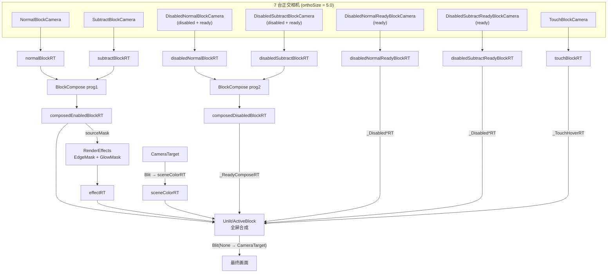

# BlockArea 渲染管线与着色器

## 源码可得性

::: danger 修正：着色器源码**可以**获取
本文档早期版本称「着色器源码不可得」，**该结论错误**，现予更正。

Unity 并未剥离源码，而是将其**经 LZ4 压缩**后存入 `Shader` 对象的 `compressedBlob` 字段。
由于压缩载荷不含任何明文标记，全文搜索 `CGPROGRAM` / `SubShader` / `#pragma` 均无结果，
容易被误判为已剥离。

真正的原因是**解析工具版本不匹配**：UnityPy 1.10.18 的内置 `Shader` typetree 对应旧版 Unity，
解析本包（Unity **2022.3.62f2**）时会抛 `Can't read N bytes at position M of M` 而静默失败，
导致 `compressedBlob` 字段根本没被读出。换用 UnityPy **1.25.3** 后即可正确读出并解压。
:::

### 提取方法

```python
import UnityPy, lz4.block as lz4b

env = UnityPy.load("assets/bin/Data/data.unity3d")   # 需与其 .resource 同目录
for o in env.objects:
    if o.type.name != "Shader":
        continue
    t = o.read_typetree()
    name = t["m_ParsedForm"]["m_Name"]
    blob = bytes(t["compressedBlob"])
    for k, (off, clen, dlen) in enumerate(zip(
            t["offsets"][0], t["compressedLengths"][0], t["decompressedLengths"][0])):
        src = lz4b.decompress(blob[off:off + clen], uncompressed_size=dlen)
        # src.decode("utf-8") 即为完整 GLSL ES 源码
```

::: tip
载荷为 **GLSL ES 3.00**（`#version 300 es`），平台标记 `platforms = [9]`（GLES3Plus）。
这是 Unity 从 ShaderLab 编译后的产物，变量已扁平化为 `u_xlatN`、语义已改写为 `in`/`out`，
**不是原始 ShaderLab**，但足以等价还原。
:::

全包共提取出 **124 个着色器程序**，其中块系统相关 9 个，位于 [`shaders/`](./shaders/)。

## 图层与相机

块系统使用 **7 个自定义 layer**（Unity layer 索引 11–17），每层由一台专用相机渲染。
机制是标准的 `Camera.m_CullingMask`（32 位掩码，位 `i` 对应 layer `i`），**不是**
`CommandBuffer.DrawRenderer` 显式绘制。

| layer | 名称 | 渲染它的相机 | 该相机的 mask（十进制 / 十六进制） |
| --- | --- | --- | --- |
| 11 | `NormalBlock` | `normalBlockCamera` | `2048` / `0x00000800` |
| 12 | `SubtractBlock` | `subtractBlockCamera` | `4096` / `0x00001000` |
| 13 | `DisabledNormalBlock` | `disabledNormalBlockCamera` | `40960` / `0x0000A000` |
| 14 | `DisabledSubtractBlock` | `disabledSubtractBlockCamera` | `81920` / `0x00014000` |
| 15 | `DisabledNormalReadyBlock` | ↑ 同上 / `disabledNormalReadyBlockCamera` | `32768` / `0x00008000` |
| 16 | `DisabledSubtractReadyBlock` | ↑ 同上 / `disabledSubtractReadyBlockCamera` | `65536` / `0x00010000` |
| 17 | `TouchBlock` | `touchBlockCamera` | `131072` / `0x00020000` |

相机与 `BlockRender` 的字段一一对应（均在 `sharedassets12.assets`）：

| pathID | 字段 | 掩码 | 解码后可见 layer |
| --- | --- | --- | --- |
| 198 | `normalBlockCamera` | `2048` | bit11 `NormalBlock` |
| 199 | `subtractBlockCamera` | `4096` | bit12 `SubtractBlock` |
| 196 | `disabledNormalBlockCamera` | `40960` | bit13 + bit15 |
| 197 | `disabledSubtractBlockCamera` | `81920` | bit14 + bit16 |
| 195 | `disabledNormalReadyBlockCamera` | `32768` | bit15 |
| 201 | `disabledSubtractReadyBlockCamera` | `65536` | bit16 |
| 200 | `touchBlockCamera` | `131072` | bit17 |

7 台相机的场景序列化参数**完全一致**（`sharedassets12.assets` pathID `195`–`201`）：

| 参数 | 值 |
| --- | --- |
| `orthographic` | `true`（**正交**投影） |
| `orthographic size` | `5.0` |
| `m_NormalizedViewPortRect` | `(0, 0, 1, 1)` 全屏 |
| `near clip plane` | `0.3` |
| `far clip plane` | `1000` |
| `m_Depth` | `0` |
| `m_TargetTexture` | 留空（运行时由 `BlockRender.Start` 赋值） |
| Transform | `localScale = 1`，`localPosition = (0, 0, −10)` |

::: tip `orthographic size = 5.0` 是**生效值**，不是默认占位
块的世界坐标由 `PreviewElementUpdateControl.Awake`（VA `0x1D79FE8`）定义：

```csharp
screenHeight = 2f * previewCam.orthographicSize;        // = 10
screenWidth  = screenHeight * previewCam.aspect;        // = 10 * aspect ≈ 17.78
```

`DestroyAndCreateAllBlocks` 再把这对值写进每个块的 `screenWidth`(`0x40`) / `screenHeight`(`0x44`)。
`AnchorToWorld(p) = (p − 0.5) × screen` 得到的即**世界坐标**。块 prefab 是单位 quad，
`localScale = size` 直接是 10 量级——与 `5.0` 的相机完全自洽。

::: danger 初版两处判断均错误
1. 初版称「`orthographic size = 5.0` 必定被运行时覆盖」——**错误**。`5.0` 就是生效值：
   `Awake` 直接用它算世界尺寸，且本资产的**全部**相机（`level12` 2 台 + `sharedassets12` 7 台）
   都是 `5.0`，**没有**任何覆盖点。
2. 初版称「1 世界单位 = 1 像素」——**错误**。`screenWidth/screenHeight` 是世界单位
   （≈`17.78 × 10`），不是像素；正因如此 `5.0` 才成立。
:::
:::

场景中仅有 **2 个** `RenderTexture` 对象（`1920×1080` 与 `1920×1440`，后者是 3:4
竖屏），与块系统无关——13 张块 RT 全部是 `CreateRenderTexture` 在运行时创建的。

::: danger 十六进制掩码极易手算出错
本文档初版曾把 `40960` 写成 `0x0000C000`、`81920` 写成 `0x00030000`、
`131072` 写成 `0x00200000`、`65536` 写成 `0x00020000`——**十进制值全对，
十六进制全错**，且与同表的「可见 layer」列自相矛盾。

复现时请直接用十进制，或以 `tools/_cameras_verify.py` 的输出为准，不要手工换算。
:::

::: warning 提取相机数据必须用 UnityPy 1.25.3
UnityPy **1.10.18** 的 `Camera` typetree 解析不出 `m_CullingMask`，
会**静默返回 `{'m_Bits': 0}`**——不报错、不抛异常，直接产出「7 台相机掩码全为 0」
的错误数据。本文初版正是被这一点误导，一度以为掩码由运行时设置。

`tools/_dump_params.py` 已固定使用隔离安装的 1.25.3，并加了
`assert "upy13" in UnityPy.__file__` 与「layer 为空则拒绝写出」两道保险。
:::

::: tip 这解释了 `ReadyBlock` 的输入 RT
196 与 197 的掩码**各含两个 layer**——禁用态与预备态被渲染进**同一张 RT**
（`disabledNormalBlockRT` / `disabledSubtractBlockRT`）。

所以 `Unlit/ReadyBlock` 虽读名为 `Disabled*` 的 RT，拿到的其实是「禁用态 + 预备态」
的**合并遮罩**，而不是只有禁用态。这也是早期「预备态 RT 无人读取」这一困惑的答案。
:::

## RT 管线

```
[场景 SpriteRenderer, layer = 11..17]
   ├─▶ normalBlockCamera(198)               ──▶ normalBlockRT
   ├─▶ subtractBlockCamera(199)             ──▶ subtractBlockRT
   ├─▶ disabledNormalBlockCamera(196)       ──▶ disabledNormalBlockRT      ┐ 含 layer 15
   ├─▶ disabledNormalReadyBlockCamera(195)  ──▶ disabledNormalReadyBlockRT  ┘
   ├─▶ disabledSubtractBlockCamera(197)     ──▶ disabledSubtractBlockRT    ┐ 含 layer 16
   ├─▶ disabledSubtractReadyBlockCamera(201)──▶ disabledSubtractReadyBlockRT┘
   └─▶ touchBlockCamera(200)                ──▶ touchBlockRT

  Unlit/BlockSprite          画单位 quad（顶点仅 ObjectToWorld × MatrixVP）
  Unlit/SubtractBlockBlender 双阈值 → 归属 / 覆盖度
  Unlit/EdgeMask             8 邻域 max 膨胀，减去 _ComposeRT，逐轮累积
  Unlit/GlowMask             加权膨胀（_PassWeight）+ 通道搬运
  Unlit/BlockCompose         两路遮罩合并
  Unlit/ReadyBlock           呼吸脉冲 + discard
  Unlit/DisabledBlock        填充 + 火花
  Unlit/ActiveBlock          主着色器，汇总以上 RT 输出最终画面
  Unlit/TouchEffect          触摸层（噪声 / SDF / 辉光）
  SubtractBlockPostProcessor 在 targetPass 0/1 处把减块从场景色中扣除
```

渲染数据流（按 `Start` 绑定 + `LateUpdate`/`RenderEffects` 实测）：



> 注意同名的 `_DisabledNormalBlockRT` / `_DisabledSubtractBlockRT` sampler 在不同材质上绑**不同的 RT**：
> `blockComposeMaterial` 绑「合并」遮罩，`activeBlockMaterial` / `blockReadyMaterial` 绑「纯预备」遮罩。

### RT 尺寸与格式（反汇编实测）

`BlockRender.Start`（VA `0x1D1BC4C`）调用 `CreateRenderTexture` **13** 次，尺寸全部由
`Screen.get_width()/height()` 派生（**非全屏**）：

| 字段 | 偏移 | 尺寸 | 格式 | Filter |
| --- | --- | --- | --- | --- |
| `sceneColorRT` | `0xB8` | `Screen/6` | 16 | Point |
| `normalBlockRT` | `0xC0` | `Screen/8` | 16 | Point |
| `subtractBlockRT` | `0xC8` | `Screen/8` | 16 | Point |
| `composedEnabledBlockRT` | `0xF0` | `Screen/8` | 16 | Point |
| `disabledNormalBlockRT` | `0xD0` | `Screen/8` | 25 | Point |
| `disabledSubtractBlockRT` | `0xD8` | `Screen/8` | 25 | Point |
| `disabledNormalReadyBlockRT` | `0xE0` | `Screen/8` | 25 | Point |
| `disabledSubtractReadyBlockRT` | `0xE8` | `Screen/8` | 25 | Point |
| `composedDisabledBlockRT` | `0xF8` | `Screen/8` | 25 | Point |
| `touchBlockRT` | `0x100` | `Screen/8` | 16 | Point |
| `effectRT` | `0x108` | `Screen/4` | 25 | **Bilinear** |
| `pingA` | `0x110` | `Screen/4` | 25 | Point |
| `pingB` | `0x118` | `Screen/4` | 25 | Point |

- 除法来自 `Start` 的定点运算：`sceneColorRT` 用魔数 `0x2AAAAAAB`（= 1/6），
  块 RT 用 `asr #3`（= 1/8），`effectRT`/ping 再 `lsl #1`（= 1/4）。
- `CreateRenderTexture`（VA `0x1D1C5B0`）内部就是
  `new RenderTexture(w, h, depth, format, filter)` + `set_useMipMap(false)` + `Create()`；
  `filterMode` 由第 4 个实参传入——**只有 `effectRT` 是 Bilinear**，其余（含所有块遮罩）都是 Point。
- 结论：块遮罩工作分辨率是屏幕的 **1/8**（1080p 下 `240×135`），边缘/辉光在 **1/4**（`480×270`）。

### `LateUpdate` / `RenderEffects` 实测顺序

`BlockRender.LateUpdate`（VA `0x1D1CFD8`；`composedEnabledBlockRT` / `composedDisabledBlockRT` /
`effectRT` 任一为空则提前返回）：

1. `UpdateDilateTexelSize()`
2. `Blit(null, composedEnabledBlockRT, blockComposeMaterial, pass 0)` —— program 1（带位移）
3. `RenderEffects(composedEnabledBlockRT, effectRT)` —— 边缘 + 辉光
4. `Blit(null, composedDisabledBlockRT, blockComposeMaterial, pass 1)` —— program 2
5. `RefreshSceneColorCommands()`（尾调用）

`RenderEffects(sourceMask, dest)`（VA `0x1D1D114`）先把 `sourceMask` 绑到
`edgeMaskMaterial._MainTex` 与 `glowMaskMaterial._MainTex`，然后：

- **EdgeMask**：`edgeSize == 1` → 直接 `Blit(sourceMask, effectRT, edgeMaskMaterial, pass 1)`
  （含 `_ComposeRT` 累减）；`edgeSize ≥ 2` → 先 `Blit → pingA`（pass 0），再 ping-pong，
  末轮 `pass 1` 写 `effectRT`。
- **GlowMask**：清空 `pingA`/`pingB`，逐轮 `SetFloat(_PassWeight, GetGlowRingWeight(p, glowRadius, glowWeightFalloff))`；
  首轮置 `_GlowFirstPass = 1`，`Blit(sourceMask → pingA)`，之后 `Blit(pingA → pingB)` 并**交换 pingA/pingB**；
  权重 < `glowPassWeightThreshold` 即停。
- 末轮 `Blit(pingA, effectRT, glowMaskMaterial, pass 1)`：该 pass **只写 `.y`（辉光）**，
  因此 `effectRT.x`（边缘）被保留。

::: tip ping-pong 推断已被反汇编证实
`RenderEffects` 每轮用 `stp`/`ext` 交换 `pingA`(`0x110`) 与 `pingB`(`0x118`)，
证实此前 🔶「逐轮膨胀在两张 RT 间 ping-pong」的推断。
:::

::: tip `SubtractBlockPostProcessor.OnRenderImage` 已解
（VA `0x1D1E718`）`if (cam.targetTexture == null) Blit(source, dest);`
`else Blit(source, dest, material, targetPass);` —— 后者即在 `targetPass` 处叠加
`subtractBlockMaterial` 把减块从场景色中扣除。
:::

### 固定管线状态（Blend / ZTest / ZWrite / Cull / ColorMask）

**Blend 不属于 fragment shader**，因此不在 `compressedBlob → GLSL` 里，而在 **Shader 资产的
`m_ParsedForm.m_SubShaders[i].m_Passes[j].m_State`**。从 `sharedassets12.assets` 直接读出
（9 个块 shader，材质→shader pathID 见[材质表](#着色器清单)）：

| shader | pass | Blend（src, dst） | BlendOp | ColorMask | ZTest | ZWrite | Cull |
| --- | --- | --- | --- | --- | --- | --- | --- |
| `Unlit/ActiveBlock`(38) | 0 | **`One, OneMinusSrcAlpha`** | Add | RGBA | Always | Off | Off |
| `Unlit/BlockCompose`(40) | 0/1 | `One, Zero` | Add | RGBA | LEqual | Off | Off |
| `Unlit/DisabledBlock`(39) | 0 | `One, One` | Add | RGBA | LEqual | Off | Off |
| `Unlit/ReadyBlock`(36) | 0 | `SrcAlpha, One` | Add | RGBA | Always | Off | Off |
| `Unlit/BlockSprite`(37) | 0 | `SrcAlpha, One` | Add | RGBA | LEqual | Off | Off |
| `Unlit/EdgeMask`(34) | 0 | `One, Zero` | Add | RGBA | Always | Off | Off |
| | 1 | `One, Zero` | Add | **R** | Always | Off | Off |
| `Unlit/GlowMask`(32) | 0 | `One, Zero` | Add | **RG** | Always | Off | Off |
| | 1 | `One, Zero` | Add | **G** | Always | Off | Off |
| `Unlit/TouchEffect`(33) | 0 | `One, One` | Add | RGBA | Always | Off | Off |
| `Unlit/SubtractBlockBlender`(35) | 0/1 | `One, Zero` | Add | RGBA | LEqual | Off | Off |

::: danger `Unlit/ActiveBlock` 是**预乘 alpha**，不是直通 alpha
`ActiveBlock` 的固定状态是 **`Blend One OneMinusSrcAlpha`**（`srcBlend = One`），
即 `dst = src + dst·(1 − srcA)`：

- **不是** `SrcAlpha OneMinusSrcAlpha`（直通/straight alpha）；
- fragment 输出的 `rgb` 需按 `a` **预乘**，否则边缘会偏亮/发光过强。
- `SV_Target.w`（`glowAdj·_GlowIntensity + comp·_FillOpacity + edge·_EdgeOpacity`）
  参与这条混合式；`ColMask = RGBA`，alpha 会写入 `CameraTarget`。

这解释了「扭曲背景被填色覆盖」的现象：填色 rgb 直接相加，背景按 `(1−a)` 衰减。
:::

::: tip 解码与自洽性
`colMask` = Unity `ColorWriteMask`（R=8/G=4/B=2/A=1）。`EdgeMask` pass1 只写 `R`
（= `_EffectRT.x` 边缘）、`GlowMask` pass1 只写 `G`（= `_EffectRT.y` 辉光），与
`ActiveBlock` 对 `_EffectRT.x/.y` 的读取完全对上。`ZWrite` 全 Off、`Cull` 全 Off。
:::

### `Start` 的相机 / 材质绑定

`BlockRender.Start`（VA `0x1D1BC4C`）在建完 13 张 RT 后，把它们绑到 7 台相机与 7 个材质。
下表由反汇编的 `set_targetTexture` / `SetTexture(nameID,…)` 逐条读出；`nameID` 按
`BlockRender.ShaderIDs` 字段表还原（属性名 = `"_"` + 字段名，与 9 个 GLSL 的 uniform 吻合；
`ShaderIDs..cctor` 已确认按字段顺序逐个 `Shader.PropertyToID`）。

**相机 ← RT**

| 相机（字段） | targetTexture |
| --- | --- |
| `normalBlockCamera`(0x20) | `normalBlockRT` |
| `subtractBlockCamera`(0x28) | `subtractBlockRT` |
| `disabledNormalBlockCamera`(0x30) | `disabledNormalBlockRT` |
| `disabledSubtractBlockCamera`(0x38) | `disabledSubtractBlockRT` |
| `disabledNormalReadyBlockCamera`(0x40) | `disabledNormalReadyBlockRT` |
| `disabledSubtractReadyBlockCamera`(0x48) | `disabledSubtractReadyBlockRT` |
| `touchBlockCamera`(0x50) | `touchBlockRT` |

**材质 ← RT**

| 材质（字段） | 属性 | 绑定的 RT |
| --- | --- | --- |
| `blockComposeMaterial`(0x80) | `_NormalBlockRT` | `normalBlockRT` |
| | `_SubtractBlockRT` | `subtractBlockRT` |
| | `_DisabledNormalBlockRT` | `disabledNormalBlockRT` |
| | `_DisabledSubtractBlockRT` | `disabledSubtractBlockRT` |
| `activeBlockMaterial`(0x60) | `_EffectRT` | `effectRT` |
| | `_ComposeRT` | `composedEnabledBlockRT` |
| | `_SceneColor` | `sceneColorRT` |
| | `_ReadyComposeRT` | `composedDisabledBlockRT` |
| | `_DisabledNormalBlockRT` | `disabledNormalReadyBlockRT` |
| | `_DisabledSubtractBlockRT` | `disabledSubtractReadyBlockRT` |
| | `_TouchHoverRT` | `touchBlockRT` |
| `disabledBlockMaterial`(0x68) | `_ComposeRT` | `composedDisabledBlockRT` |
| `blockReadyMaterial`(0x70) | `_DisabledNormalBlockRT` | `disabledNormalReadyBlockRT` |
| | `_DisabledSubtractBlockRT` | `disabledSubtractReadyBlockRT` |
| | `_ComposeRT` | `composedDisabledBlockRT` |
| `touchEffectMaterial`(0x78) | `_TouchHoverRT` | `touchBlockRT` |
| `edgeMaskMaterial`(0x88) | `_ComposeRT` | `composedEnabledBlockRT` |
| `glowMaskMaterial`(0x90) | `_ComposeRT` | `composedEnabledBlockRT` |

要点：

- **`EdgeMask` / `GlowMask` 的 `_ComposeRT` = `composedEnabledBlockRT`**；`_MainTex` 不在此显式绑定，
  而由每次 `Graphics.Blit(source,…)` 自动作为 `_MainTex` 传入。
- `Start` 还从 `activeBlockMaterial` 读出三个触摸参数缓存到 `BlockRender`：
  `touchShineSpeed`(0x148) ← `_TouchPosShineSpeed`、`touchShineLowThreshold`(0x14C) ←
  `_TouchPosLowThreshold`、`touchShineBrightness`(0x150) ← `_TouchPosBrightness`。
- 随后调用 `CopyReadyTouchParamsToActive()`：把 `blockReadyMaterial` 的 `_Shine*` 与
  `touchEffectMaterial` 的 touch 参数（`_DisplaceSpeed`→`_TouchDisplaceSpeed`、`_GlowColor`→`_TouchGlowColor`、
  `_Noise*`、`_SDF*` 等）拷入 `activeBlockMaterial`；其中两次 `CopyTexture` 复制 `_DisplaceMap`→`_TouchDisplaceMap`
  与 `_NoiseMap`。
- `fxRenderList` 里每个 `Canvas` 设 `worldCamera = mainCamera`、`sizeDelta = (2·orthoSize·aspect, 2·orthoSize)`；
  `mainCamera.forceIntoRenderTexture = true`；`blockShaderVariantCollection.WarmUp()`。
- 末尾循环 10 次从 `touchHoverPrefab` 实例化触摸槽位。

::: tip 等价 C#
以上已落为 C#：[`code/BlockRender.decompiled.cs`](./code/BlockRender.decompiled.md)（`Start` / `CopyReadyTouchParamsToActive`
/ `RenderEffects` / `LateUpdate` / `GetGlowRingWeight` / 音频 等，含 VA 与置信度标注）。
:::

::: tip `_DilateTexelSize` 已解出
`BlockRender.UpdateDilateTexelSize()` 的完整语义（反汇编 VA `0x1D1CC04`）：

```csharp
void UpdateDilateTexelSize() {
    if (effectRT == null || edgeMaskMaterial == null || glowMaskMaterial == null) return;
    int w = effectRT.width, h = effectRT.height;
    var v = new Vector4(1f / w, 1f / h, (float)w, (float)h);
    edgeMaskMaterial.SetVector(ShaderIDs.DilateTexelSize, v);
    glowMaskMaterial.SetVector(ShaderIDs.DilateTexelSize, v);
}
```

即 `_DilateTexelSize = (1/width, 1/height, width, height)`，取自 **`effectRT`** 的尺寸，
同时写入 `edgeMaskMaterial` 与 `glowMaskMaterial` 两个材质——这正是两个做膨胀的 pass。
:::

::: danger 只有 `.xy` 被使用，`.zw` 是死数据
本文档初版称「`.zw` 提供了 RT 的原始像素尺寸供着色器做像素级比较」。**这是错的**。

对 9 个 GLSL 里 `_DilateTexelSize` 的全部 22 处引用逐一核查，实际只用到了
`.xy`（及其 swizzle 组合 `.xyx`、`.xyxy`），用于 8 邻域的 texel 偏移：

```
uv ± (t.x, 0)   uv ± (0, t.y)   uv ± (t.x, t.y)
```

`.zw` 在 9 个文件中**一次都没有被读取**。
:::

::: danger 膨胀半径靠「迭代轮数」，不靠单次 UV 偏移
`edgeSize = 1`、`glowRadius = 6` 并不意味着采样时偏移 1 / 6 个 texel。
GLSL 里**没有任何地方**把半径与 `_DilateTexelSize` 相乘。

实际机制是：每轮 pass 只做 **1 texel** 的 8 邻域 max，半径由**迭代次数**实现
——`edgeSize = 1` 即 1 轮；发光名义 6 轮，但第 6 环权重 `0.0040` 低于阈值 `0.01`
被跳过，所以**实际 5 轮**。

若照初版描述实现成「一次 6 texel 偏移」，边缘形态会完全不同。
:::

## `BlockRender` 字段表

以下偏移取自 `dump.cs`（IL2CPP 声明），是理解管线的数据模型。
场景中 `BlockRender` 的 MonoBehaviour typetree 已被剥离（只剩 `m_Enabled` / `m_Name`），
因此这些字段的**运行时值**需靠反汇编或 `.rodata` 默认值确定。

| 偏移 | 类型 | 字段 |
| --- | --- | --- |
| `0x20`–`0x50` | `Camera` ×7 | 7 台块相机 |
| `0x58` | `ShaderVariantCollection` | `blockShaderVariantCollection` |
| `0x60`–`0x90` | `Material` ×7 | `activeBlockMaterial`(0x60)、`disabledBlockMaterial`(0x68)、`blockReadyMaterial`(0x70)、`touchEffectMaterial`(0x78)、`blockComposeMaterial`(0x80)、`edgeMaskMaterial`(0x88)、`glowMaskMaterial`(0x90) |
| `0x98` | `List<Canvas>` | `fxRenderList` |
| `0xA0` | `GameObject` | `touchHoverPrefab` |
| `0xA8` | `Camera` | `mainCamera`（**public**） |
| `0xB0` | `CommandBuffer` | `cmd` |
| `0xB8` | `RenderTexture` | `sceneColorRT` |
| `0xC0`–`0xE8` | `RenderTexture` ×6 | `normalBlockRT`、`subtractBlockRT`、`disabledNormalBlockRT`、`disabledSubtractBlockRT`、`disabledNormalReadyBlockRT`、`disabledSubtractReadyBlockRT` |
| `0xF0` / `0xF8` | `RenderTexture` | `composedEnabledBlockRT` / `composedDisabledBlockRT` |
| `0x100` | `RenderTexture` | `touchBlockRT` |
| `0x108` | `RenderTexture` | `effectRT` |
| `0x110` / `0x118` | `RenderTexture` | **`pingA` / `pingB`** |
| `0x120` | `List<RenderTexture>` | `totalRT` |
| `0x128` | `TouchBlockSlot[]` | 10 个触摸槽位 |
| `0x130` / `0x134` | `int` | `edgeSize` / `glowRadius` |
| `0x138` / `0x13C` | `float` | `glowWeightFalloff` / `glowPassWeightThreshold` |
| `0x140` | `List<Vector4>` | `touchPos` |
| `0x148`–`0x150` | `float` ×3 | `touchShineSpeed` / `touchShineLowThreshold` / `touchShineBrightness` |

::: warning `subtractBlockMaterial` 不在这个区间
第 8 个材质 `subtractBlockMaterial` 挂在 3 个 `SubtractBlockPostProcessor` 上
（各自持有 `material` + `targetPass` + `cam`），**不是 `BlockRender` 的字段**。
初版把它算进 `0x60`–`0x90` 的 8 个指针槽里，但该区间只有 7 个槽位。
:::

::: tip 共 13 张 RT
`pingA` / `pingB` 的存在**证实了逐轮膨胀用的是 ping-pong**——`EdgeMask` 与 `GlowMask`
的多轮迭代在两张同尺寸 RT 之间来回读写。这也解释了为何 `EdgeMask` 要「减去
`_ComposeRT` 再取 max」：它需要上一轮的结果作为差分基准。
:::

::: tip `glowWeightFalloff` 之谜已解
早期文档把发光权重里的两个常量描述为「`.rodata` 中的 epsilon，取值不明」。
现在可确认它们就是具名字段 **`glowWeightFalloff`**（`2.65`）与
**`glowPassWeightThreshold`**，并且 `2.65` 与 `glowRadius = 6` 配套。
:::

## 材质参数

以下为 `sharedassets12.assets` 中各材质**保存的**属性值。完整数据见
[`block-params.json`](./block-params.md)（由 `tools/_dump_params.py` 以
UnityPy 1.25.3 生成）。

### `activeBlockMaterial`（pathID 5 → shader `Unlit/ActiveBlock`）

| 参数 | 值 | 参数 | 值 | 参数 | 值 |
| --- | --- | --- | --- | --- | --- |
| `_EdgeOpacity` | `0.80` | `_GlowIntensity` | `0.80` | `_ShineSpeed` | `37.9` |
| `_FillOpacity` | `0.667` | `_FillStrength` | `0.667` | `_ShineBrightness` | `0.12` |
| `_BackgroundPixelScale` | `6.0` | `_DisplaceBlendIntensity` | `0.411` | `_SparkMapOpacity` | `5.69` |
| `_DisplaceSpeed` | `1.5` | `_DisplaceStrength` | `0.15` | `_SparkDisplaceIntensity` | `2.39` |
| `_TouchPosRadius` | `0.5` | `_TouchPosBrightness` | `2.0` | `_SparkHueShiftAmount` | `0.20` |
| `_TouchPosDarkness` | `0.65` | `_TouchPosLowThreshold` | `0.63` | `_SparkDisplaceBlendIntensity` | `0.5` |
| `_TouchPosShineSpeed` | `43.0` | `_TouchPosSDFFalloff` | `0.41` | `_TouchPosSDFSmoothness` | `0.47` |
| `_TouchBackgroundPixelScale` | `8.0` | `_TouchDisplaceSpeed` | `2.9` | `_TouchDisplaceStrength` | `0.08` |
| `_SDFCellSize` | `0.11` | `_SDFFalloff` | `0.34` | `_SDFSmoothness` | `0.63` |
| `_SDFMoveSpeed` | `9.3` | `_NoiseRadius` | `0.48` | `_NoiseSmoothness` | `1.0` |
| `_NoiseEvoSpeed` | `0.03` | `_NoiseDirChangeSpeed` | `60.0` | `_NoiseDisplaceStrength` | `1.0` |

颜色：

| 参数 | 值 |
| --- | --- |
| `_EdgeColor` | `(1.0, 0.330, 0.330, 1)` |
| `_FillColor` | `(0.713, 0.235, 0.235, 1)` |
| `_GlowColor` | `(1.0, 0.179, 0.179, 1)` |
| `_SparkTint` | `(1.0, 0.285, 0.285, 1)` |
| `_ShineColor` | `(1, 1, 1, 1)` |
| `_NoiseTint` / `_TouchGlowColor` | `(1, 0, 0, 1)` |
| `_DisplaceDirection` / `_TouchDisplaceDirection` | `(1, 1, 0, 0)` |

贴图：`_DisplaceMap` 与 `_TouchDisplaceMap` → pathID `30`；`_NoiseMap` → `15`；`_SparkMap` → `17`。

::: tip
`_EdgeColor` / `_GlowColor` / `_SparkTint` 三者满足 `r = 1` 且 `g = b`，是同一色相的
不同明度；而 `_FillColor = (0.713, 0.235, 0.235, 1)` 的 `r` **不是 1**——
它是「红 + 一份填充色」的叠加结果，不可与前三者同列。

`_TestTP1` / `_TestTP2` 是遗留调试值。
:::

::: tip `_Shine*` 只有两个材质有
初版称「`blockComposeMaterial`、`disabledBlockMaterial`、`blockReadyMaterial`
三者共用同一组 `_Shine*`」。**这是错的**——`block-params.json` 显示只有
**2 个**材质保存了 `_Shine*`：

| 材质 | pathID | `_ShineSpeed` | `_ShineBrightness` | `_ShineColor` |
| --- | --- | --- | --- | --- |
| `activeBlockMaterial` | 5 | `37.9` | `0.12` | `(1,1,1,1)` |
| `blockReadyMaterial` | 11 | `37.9` | `0.12` | `(1,1,1,1)` |

`disabledBlockMaterial`（8）与 `blockComposeMaterial`（6）**没有**任何 `_Shine*` 条目。
初版那句「说明四者由同一套参数驱动」的推断随之失效。
:::

### 其他材质

| 材质 | pathID | shader | 关键参数 |
| --- | --- | --- | --- |
| `blockComposeMaterial` | 6 | `Unlit/BlockCompose` | `_DisplaceSpeed 2.59`，`_DisplaceStrength 0.10`，`_DisplaceDirection (0.5,0.5,0,0)` |
| `disabledBlockMaterial` | 8 | `Unlit/DisabledBlock` | `_EdgeOpacity 1.0`，`_FillOpacity 0.40`，`_GlowIntensity 0.0`，`_SparkMapOpacity 3.5`，`_SparkHueShiftAmount 0.73`；`_FillColor (0.497,0.138,0.138,1)`，`_SparkTint (0.311,0.078,0.078,1)` |
| `edgeMaskMaterial` | 9 | `Unlit/EdgeMask` | 无保存参数（`_DilateTexelSize` 运行时写入） |
| `glowMaskMaterial` | 10 | `Unlit/GlowMask` | `_GlowFirstPass 0.0`，`_PassWeight 0.02494780719280243` |
| `blockReadyMaterial` | 11 | `Unlit/ReadyBlock` | `_ShineSpeed 37.9`，`_ShineBrightness 0.12`，`_ShineColor (1,1,1,1)` |
| `subtractBlockMaterial` | 12 | `Unlit/SubtractBlockBlender` | `_ClampThresholdLow 0.09`，`_ClampThresholdHigh 0.12` |
| `touchEffectMaterial` | 13 | `Unlit/TouchEffect` | `_GlowRadius 0.0`，`_GlowEaseGap 1.0`，`_NoiseEaseGap 0.10`；噪声/SDF/位移参数与 `activeBlockMaterial` 相同 |

::: warning 上述三个参数在 GLSL 里不存在
`_GlowRadius` / `_GlowEaseGap` / `_NoiseEaseGap` 出现在材质的 `m_SavedProperties` 里，
但 grep `Unlit_TouchEffect.glsl` 的全部 uniform 声明，**这三个都没有**。

它们应是 ShaderLab 中声明、但在当前变体编译时被剔除的属性（Unity 对未使用的
float 属性仍会保留序列化值）。绑定它们不会产生任何效果，复现时可忽略。
:::

::: tip 两条独立交叉验证
- **`_PassWeight = 0.0249478`** 与[加权膨胀](#unlitglowmask--加权膨胀)算出的第 5 环权重
  `0.0249` 吻合到 8 位有效数字。注意它是**构建时序列化的默认值**，不是运行时快照。
- **`_ClampThreshold` 区间仅 `0.09`~`0.12`**，是一条很窄的过渡带。结合
  `k = clamp((t.y − 0.2) × −10, 0, 1)`，实际行为为：遮罩值落在 `[0.09, 0.12)`
  时 `st = 1`，带外为 `0`，再叠加边缘抬升项。
:::

## 遮罩的数据布局

::: danger 并非所有块 RT 都是 `vec2`
初版称「所有块 RT 均为 `vec2`」。实际逐个 shader 核查：

| 着色器 | 输出类型 |
| --- | --- |
| `SubtractBlockBlender` program 1 | **标量 `float`** |
| `BlockCompose` program 1 | **标量 `float`** |
| `ReadyBlock` | **`vec4`** |
| 其余 | `vec2` |
:::

通道语义（以 `vec2` 的 RT 为例）：

| 通道 | 含义 | 写入者 |
| --- | --- | --- |
| `x` | 归属 / 强度，取值 `0`~`2` | `SubtractBlockBlender` |
| `y` | 覆盖度，**取值 `0`~`20`** | `SubtractBlockBlender` |

::: danger `y` 的范围不是 `0`~`1`
`SubtractBlockBlender` 实际写入的是 `SV_Target.y = t.y * v * 10.0`。
因 `v ∈ [0, 2]`、`t.y ∈ [0, 1]`，故 `y` 最大可达 **20**，不是 1。
初版的「覆盖度 `0`~`1`」与实现不符。
:::

`SubtractBlockBlender` 的 `x` 在两阈值之间为 `1`、之外为 `0`，并叠加一项边缘抬升
（见[下文](#unlitsubtractblockblender--双阈值阶跃--smoothstep)），故范围为 `[0, 2]`。

`BlockCompose` 用**通道相乘**再与禁用态相减：

```glsl
float t = ds.x * ds.y - dn.x;      // ds = _SubtractBlockRT, dn = _DisabledNormalBlockRT
SV_Target = vec2(abs(t), ds.y);
```

::: warning 不是「强度 × 覆盖度」那么简单
初版称该式「把 `x` 还原成强度 × 覆盖度」。代入实际写入式，
它等于 `v · (t.y · v · 10)` = **`10·t.y·v²`**，是一个对 `v` 二次的项，
并非两个独立语义的简单相乘。复现时建议照抄代码而非套用直觉。
:::

::: warning 术语更正
早期版本称 `x` 为「带符号归属标记（±1）」，**错误**。该通道并非带符号，
`abs()` 的存在也不代表它是负数区间的产物。
:::

### RT 字段 ↔ 着色器 sampler 对照

::: danger 初版缺这张表，13 张 RT 无法落地
`BlockRender` 的字段名与着色器的 sampler 名**并不一致**，且部分 RT 在 GLSL 里
根本不出现（它们只作为 CPU 侧 `SetTexture` 的源，或供后处理链使用）。
:::

| `BlockRender` 字段 | 绑定的 sampler（材质） | GLSL 中出现 |
| --- | --- | --- |
| `normalBlockRT` | `_NormalBlockRT`（compose） | ✅ `BlockCompose` prog1 |
| `subtractBlockRT` | `_SubtractBlockRT`（compose） | ✅ `BlockCompose` prog1/2 |
| `disabledNormalBlockRT` | `_DisabledNormalBlockRT`（compose） | ✅ `BlockCompose` prog2（禁用+预备合并遮罩） |
| `disabledSubtractBlockRT` | `_DisabledSubtractBlockRT`（compose） | ✅ `BlockCompose` prog2 |
| `disabledNormalReadyBlockRT` | `_DisabledNormalBlockRT`（**active / ready**） | ✅ `ActiveBlock` / `ReadyBlock`（纯预备遮罩） |
| `disabledSubtractReadyBlockRT` | `_DisabledSubtractBlockRT`（**active / ready**） | ✅ `ActiveBlock` / `ReadyBlock` |
| `composedEnabledBlockRT` | `_ComposeRT`（active / edgeMask / glowMask） | ✅ 多处 |
| `composedDisabledBlockRT` | `_ReadyComposeRT`（active）、`_ComposeRT`（disabled / ready） | ✅ `ActiveBlock` / `DisabledBlock` / `ReadyBlock` |
| `touchBlockRT` | `_TouchHoverRT`（active / touchEffect） | ✅ `ActiveBlock` / `TouchEffect` |
| `sceneColorRT` | `_SceneColor`（active） | ✅ `ActiveBlock` |
| `effectRT` | `_EffectRT`（active） | ✅ `ActiveBlock`（像素中心对齐） |
| `pingA` / `pingB` | —（CPU ping-pong） | ❌ 仅 CPU 侧交换 |

绑定来源：`BlockRender.Start` 的 `SetTexture` 逐条实测，见 [Start 的相机/材质绑定](#start-的相机--材质绑定)。

::: danger 初版对 `*ReadyBlockRT` 的结论是错的
初版写「`disabledNormalReadyBlockRT` / `disabledSubtractReadyBlockRT` 不出现在任何 GLSL、
无消费者」——**错误**。它们**确实被采样**：被绑到 `activeBlockMaterial` 与
`blockReadyMaterial` 的 `_DisabledNormalBlockRT` / `_DisabledSubtractBlockRT` sampler 上
（**RT 字段名带 `Ready`，sampler 名不带**，所以按字段名去 GLSL 里搜永远搜不到）。

- `disabledNormalBlockRT` / `disabledSubtractBlockRT`（相机 196/197，渲染 disabled+ready
  两个 layer 的**合并**遮罩）→ `blockComposeMaterial`，供 `BlockCompose` prog2。
- `disabledNormalReadyBlockRT` / `disabledSubtractReadyBlockRT`（相机 195/201，只渲染 ready
  layer 的**纯预备**遮罩）→ `activeBlockMaterial` / `blockReadyMaterial`。

命中判定与 RT 无关（纯 CPU `InverseTransformPoint` + AABB）。
:::

## 关键算法（以下均摘自真实 GLSL）

### `Unlit/EdgeMask` — 邻域 max 膨胀 + 累减

```glsl
float m = 0.0;
m = max(texture(_MainTex, uv + vec2( t.x, 0.0)).x, m);
m = max(texture(_MainTex, uv).x,                          m);
m = max(texture(_MainTex, uv + vec2(-t.x, 0.0)).x, m);
m = max(texture(_MainTex, uv + vec2(0.0, -t.y)).x, m);
m = max(texture(_MainTex, uv + vec2(0.0,  t.y)).x, m);
m = max(texture(_MainTex, uv + vec2(-t.x,  t.y)).x, m);
m = max(texture(_MainTex, uv + vec2( t.x, -t.y)).x, m);
m -= texture(_ComposeRT, uv).x;              // 减去上一轮结果 → 只保留新增的环
m  = clamp(m, 0.0, 1.0);
SV_Target = vec2(m, 0.0);
```

::: tip 这是膨胀，不是模糊
取 `max` 而非平均，因此边缘是硬扩张。减去 `_ComposeRT` 使每一轮只贡献**新的一圈**，
`edgeSize` 实际控制的是「累积深度」。输出为 `vec2`。
:::

### `Unlit/GlowMask` — 加权膨胀

`_PassWeight` 由 CPU 侧的 `GetGlowRingWeight` 写入：

```csharp
// BlockRender.GetGlowRingWeight(int passIndex, int glowRadius, float falloff)   VA 0x1D1D750
const float kEps1 = 0.001f;   // .rodata 0xC26530
const float kEps2 = 1e-6f;    // .rodata 0xC26384

if (glowRadius < 1) return 0f;

if (falloff > kEps1) {
    float sum = 0f;
    for (int i = glowRadius; i > 0; i--)
        sum += Mathf.Pow(i, falloff);
    if (sum > kEps2)
        return Mathf.Pow(glowRadius - passIndex, falloff) / sum;
}

return 1f / glowRadius;
```

::: tip 两个 epsilon 是 `.rodata` 常量，**不是**具名字段
`GetGlowRingWeight`（VA `0x1D1D750`）里的两个判据实测为**常量**：

| 常量 | 值 | `.rodata` |
| --- | --- | --- |
| `kEpsFalloff`（`falloff` 下界） | `0.001` | `0xC26530` |
| `kEpsSum`（`sum` 下界） | `1e-6` | `0xC26384` |

即 `falloff > 0.001` 才进入加权分支、`sum > 1e-6` 才做归一化；否则回退 `1/glowRadius`。

::: danger 初版结论有误
初版称这两个 epsilon「就是具名字段 `glowWeightFalloff`（`2.65`）与 `glowPassWeightThreshold`（`0.01`）」——
**错误**。若 `kEps1` 真是 `2.65`，则传进来的 `falloff = glowWeightFalloff = 2.65` 永不 `> 2.65`，
发光永远退化成均匀 `1/R`，与实际权重表矛盾。两个具名字段确实存在，但分别用在别处：
`glowWeightFalloff` 作为 `falloff` **参数**传入，`glowPassWeightThreshold` 用在 `RenderEffects`
里跳过权重过低的轮次。
:::
:::

与 Inspector 中的 Tooltip 一致：

- `falloff = 0` → 均匀，每环权重 `1/R`
- `falloff = 1` → 线性三角，`(R − p) / Σi`
- 更大 → 向外衰减更快

#### 代入实际参数

`glowRadius = 6`、`glowWeightFalloff = 2.65`、`glowPassWeightThreshold = 0.01`：

$$\text{sum} = \sum_{i=1}^{6} i^{2.65} = 251.5922$$

| 环 `p` | `(6−p)^2.65` | 权重 `= /251.5922` | 是否执行 |
| --- | --- | --- | --- |
| 0 | `115.3721` | `0.4586` | ✅ |
| 1 | `71.1657` | `0.2829` | ✅ |
| 2 | `39.3966` | `0.1566` | ✅ |
| 3 | `18.3811` | `0.0731` | ✅ |
| 4 | `6.2767` | `0.0249` | ✅ |
| 5 | `1.0000` | `0.0040` | ❌ 低于 `0.01`，跳过 |

::: warning 上表的 ✅/❌ 表示「是否执行该轮」，与置信度标记无关
:::

::: tip 两条独立交叉验证
- **`glowMaskMaterial` 保存的 `_PassWeight = 0.0249478`** 与上表第 5 环权重
  `0.0249` **吻合到 8 位有效数字**（`(6−4)^2.65 / 251.5922 = 0.0249478079…`）。

  需注意其**证据性质**：`_PassWeight` 来自 `m_SavedProperties.m_Floats`，
  是**构建/保存时写入的序列化默认值**，运行时 `SetFloat` 不会回写资产。
  所以它是「该公式在美术资产里被采用过」的旁证，而非运行时快照。

- 因此 `glowRadius` 设为 6 时，**实际只执行 5 轮膨胀**。调参时需注意这一差值。
:::

::: danger 初版此表的中间列算错
初版写 `115.190 / 71.130 / 39.400 / 18.376 / 6.285`，与实算
`115.3721 / 71.1657 / 39.3966 / 18.3811 / 6.2767` 不符（`Σ` 与权重列是对的）。
成因是当时的校验脚本只比对 token 是否**存在**、不校验数值。
现 `tools/_verify_numbers.py` 已改为实算比对。
:::

`Unlit/GlowMask` 中另有一个只做通道清零的 pass：

```glsl
SV_Target = vec2(0.0, texture(_MainTex, uv).y);
```

::: warning 早期描述有误
曾表述为「把 G 通道搬到 B 通道」——那是 HLSL swizzle 说法，与实际代码不符。
GLSL 里输出就是 `.y = 采样得到的 .y`，位置未变。
:::

### `Unlit/BlockCompose` program 1 — 液态位移扰动（输出标量）

::: danger 这是 `normalBlockRT` / `subtractBlockRT` 的**唯一消费者**
初版只解析了本着色器的第二个 program，导致 README 第 7 步的「最小链」
**整段丢掉**了这个扰动，画面会完全没有液态流动效果。
:::

```glsl
// _DisplaceDirection 归一化
float inv = inversesqrt(dot(_DisplaceDirection.xy, _DisplaceDirection.xy));
vec2  dir = inv.xx * _DisplaceDirection.xy;

// 相位随时间旋转：rot 是 dir 的法向
float t   = _Time.x * _DisplaceSpeed;
vec2  rot = vec2(dir.y * t, -dir.x * t);

// 对 _DisplaceMap 做两次正交采样，各自中心化
float d1 = texture(_DisplaceMap, dir.xy * t + vs_TEXCOORD1.xy).x - 0.5;
float d2 = texture(_DisplaceMap, rot.xy      + vs_TEXCOORD1.xy).x - 0.5;

// 两路扰动正交合成，再乘强度
vec2  disp = dir.xy * d1 + vec2(d2 * -dir.y, d2 * dir.x);
       disp = disp * _DisplaceStrength + vs_TEXCOORD0.xy;

// 减块遮罩减普通块遮罩
float n = texture(_NormalBlockRT,   disp).x;
float s = texture(_SubtractBlockRT, disp).x;
SV_Target0 = abs(s - n);
```

四个要点：

- **输出是标量 `float`**，不是 `vec2`。
- `_DisplaceMap` 每个 tap 采样后**减 `0.5` 中心化**。
- `vs_TEXCOORD0` 是**原始中心化 UV**，`vs_TEXCOORD1` 是经 `_DisplaceMap_ST`
  变换后的 UV（顶点阶段：`vs_TEXCOORD1.xy = in_TEXCOORD0.xy * _DisplaceMap_ST.xy + _DisplaceMap_ST.zw`）。
  扰动加在 TEXCOORD0 上再采样 RT，因为 RT 需要未平铺的 UV。
- 最终 `abs(s - n)` 与 program 2 的 `abs(ds.x*ds.y - dn.x)` 是**同构**的，
  只是一个作用在生效态、一个作用在禁用/预备态，且 program 1 带位移扰动。

对应材质参数：`blockComposeMaterial` 的 `_DisplaceSpeed = 2.59`、
`_DisplaceStrength = 0.10`、`_DisplaceDirection = (0.5, 0.5, 0, 0)`
（归一化后为 `(0.7071, 0.7071)`，即 45° 斜向流动）。

### `Unlit/BlockCompose` program 2 — 禁用/预备态遮罩合成

```glsl
float dn = texture(_DisabledNormalBlockRT,   uv).x;
float ds = texture(_DisabledSubtractBlockRT, uv);
float t  = ds.x * ds.y - dn.x;
SV_Target = vec2(abs(t), ds.y);
```

::: warning 变量命名不一致
初版把同一段代码写成 `subtract` / `disabledNormal`，GLSL 原码是 `ds` / `dn`。
本文档统一采用**原码变量名**，便于与 `shaders/` 对照。
:::

`ds.x * ds.y` 的实际含义见[遮罩的数据布局](#遮罩的数据布局)——
它不是「强度 × 覆盖度」那么简单的乘积，而是 `10·t.y·v²`。

::: warning 三处同名 sampler，绑定不同（初版混淆的根因）
`BlockCompose` prog2 / `ReadyBlock` / `ActiveBlock` 都读 `_DisabledNormalBlockRT` /
`_DisabledSubtractBlockRT`，但**绑的是不同的 RT**（`Start` 的 `SetTexture` 实测）：

- `blockComposeMaterial` → `disabledNormalBlockRT` / `disabledSubtractBlockRT`
  （相机 196/197，cullingMask 各含 disabled+ready 两个 layer 的**合并遮罩**）；
- `activeBlockMaterial` / `blockReadyMaterial` → `disabledNormalReadyBlockRT` /
  `disabledSubtractReadyBlockRT`（相机 195/201，只含 ready layer 的**纯预备遮罩**）。

所以本段 `BlockCompose` prog2 的输入是**合并遮罩**，而 `ReadyBlock` / `ActiveBlock`
读到的是**纯预备遮罩**。初版按字段名去 GLSL 搜 `*ReadyBlockRT` 搜不到，才误判「无消费者」。
:::

`Unlit/ReadyBlock` 读纯预备遮罩（`*ReadyBlockRT`）与 `_ComposeRT`
（= `composedDisabledBlockRT`，即合并遮罩经 prog2 合成后的结果），据此 `discard`
掉禁用态区域并叠加呼吸脉冲。

::: tip `_ReadyComposeRT` 的生成就是本节这个 pass
`activeBlockMaterial` 的 `_ReadyComposeRT` 绑到 `composedDisabledBlockRT`，
而该 RT 正是 `BlockCompose` program 2（本段）的输出——不是「尚未解析」。
:::

`abs()` 后写入 `x`，覆盖度写入 `y`，供后续 pass 使用。

### `Unlit/SubtractBlockBlender` — 双阈值阶跃 × smoothstep

```glsl
vec2  t  = texture(_MainTex, uv).xy;

// st 只有 {0, 1} 两种取值，不是 {-1, 0, +1}
float lo = (t.x >= _ClampThresholdLow  ) ? 1.0 : 0.0;
float hi = (t.x >= _ClampThresholdHigh ) ? -1.0 : -0.0;
float st = lo + hi;

// k 在低覆盖处（t.y <= 0.1）为 1，高覆盖处（t.y >= 0.2）为 0
float k = clamp((t.y - 0.2) * -10.0, 0.0, 1.0);

float v = (k * -2.0 + 3.0) * (k * k) + st;      // = (3-2k)*k^2 + st

SV_Target = vec2(v, (t.y * v) * 10.0);
```

::: danger 取值范围是 `[0, 2]`，不是 `[-1, 1]`
早期推断「输出带符号归属标记 `±1`」**错误**。因为 `hi` 在未达高阈值时取的是 `-0.0`，
`lo + hi` 的结果只有 `0`（低于低阈值或高于高阈值）与 `1`（介于两阈值之间）。

`k ∈ [0, 1]`，故 `(3 − 2k)·k²` 的值域为 `[0, 1]`（在 `k = 1` 处取 1，在 `k = 0` 处取 0，
中间 `k = 0.5` 处为 `0.5`）。因此 `v ∈ [0, 2]`。

其效果是在**遮罩边缘**（`t.y` 低处）把归属值抬到 `1 + st`，在**内部**保持 `st`。
`SV_Target.y = t.y * v * 10` 输出覆盖度，供 `BlockCompose` 使用。
:::

### `Unlit/ReadyBlock` — 呼吸脉冲

::: warning 不是扫光
早期推断为「沿 x 移动的扫光带」，**错误**。真实实现是整体呼吸。
:::

```glsl
float dn = texture(_DisabledNormalBlockRT, uv).x;
float ds = texture(_DisabledSubtractBlockRT, uv).y;
float m  = ds - dn;                        // 带符号覆盖度
float c  = texture(_ComposeRT, uv).x;

if (abs(m) * c - 1e-4 < 0.0) discard;      // 完全在块外 → 丢弃

float pulse = sin(_Time.y * _ShineSpeed) * 0.5 + 1.0;      // 0 ~ 2
vec3  tint  = _ShineColor.rgb * _ShineBrightness;
float a     = c * abs(m);

SV_Target = vec4(vec3(a) * pulse * tint, a);
```

`_ShineSpeed` 越大呼吸越快，`_ShineBrightness` 为整体强度倍率。

### `Unlit/ActiveBlock` — 主着色器汇总合成

这是 9 个文件里最大的一个（25 KB）：它把前面所有 RT 读进来，在**一个** fragment program
里合成，因此没有「每状态一个 shader」。下列公式全部摘自
[`shaders/Unlit_ActiveBlock.glsl`](./shaders/Unlit_ActiveBlock.md)（APK 解压产物）。

顶点阶段先展开 4 个 ST、算出屏幕坐标，并输出一个关键标量：

```glsl
vs_TEXCOORD6 = (_ScreenParams.y * 0.8888889) / _ScreenParams.x;   // (8/9)(H/W)
```

#### 入口水平带状 `discard`

```glsl
float h = -abs(vs_TEXCOORD0.x - 0.5) + vs_TEXCOORD6;
if (h < 0.0) discard;     // 只保留 |u−0.5| ≤ (8/9)(H/W) 的中央竖带
```

即可绘制区被限制为「高不变时最多 16:9 宽」的中央条带。16:9 屏上 `vs_TEXCOORD6 == 0.5`，
**永不触发**；只有**超宽屏**才切掉左右两侧。这解决了早期未决的「水平带状 `discard`
的 `vs_TEXCOORD6` 语义」。

#### 采样与总遮罩

```glsl
float comp = texture(_ComposeRT, uv).x;                 // 生效遮罩 composedEnabledBlockRT
// _EffectRT 的 .x 用像素中心对齐采样；.y 直接采
vec2  ec   = (floor(uv * _EffectRT_TexelSize.zw) + 0.5) * _EffectRT_TexelSize.xy;
float edge = texture(_EffectRT, ec).x;                  // EdgeMask 输出
float glow = texture(_EffectRT, uv).y;                  // GlowMask 输出
float dn   = texture(_DisabledNormalBlockRT,   uv).x;
float ds   = texture(_DisabledSubtractBlockRT, uv).y;
float ready= texture(_ReadyComposeRT, uv).x;
float touch= texture(_TouchHoverRT,   uv).x;

float m     = ds - dn;                                  // 带符号覆盖度
float rd    = ready * abs(m);                           // 预备项
float sum   = glow + edge + comp;
float total = touch + rd + sum;
if (total - 1e-4 < 0.0) discard;                        // 完全无内容
```

#### 分支一：生效体（`sum > 1e-4`）

| 量 | 公式 |
| --- | --- |
| edge 项 | `_EdgeColor * edge * _EdgeOpacity` |
| `glowAdj` | `glow * (1 − (edge + comp))` |
| glow 项 | `_GlowColor * glowAdj * _GlowIntensity` |

位移与填充（`dir = normalize(_DisplaceDirection.xy)`，`t = _Time.x * _DisplaceSpeed`）：

```glsl
vec2 rot = vec2(dir.y * t, -dir.x * t);
// 采样前按 _BackgroundPixelScale 像素化；基 UV 用 vs_TEXCOORD1 = uv * _DisplaceMap_ST.xy
float a1 = tex(_DisplaceMap, pix(dir * t + vs_TEXCOORD1)).x;
float a2 = tex(_DisplaceMap, pix(rot       + vs_TEXCOORD1)).x;
float dispAvg = (a1 + a2) * 0.5;
vec2  disp    = dir*(a1 - 0.5) + vec2(-dir.y, dir.x)*(a2 - 0.5);
vec2  base    = pix(uv) + disp * _DisplaceStrength;             // 填充与 _SceneColor 的采样点
vec2  sparkUV = disp * _SparkDisplaceIntensity + vs_TEXCOORD2;  // vs_TEXCOORD2 = uv * _SparkMap_ST.xy
```

火花按 `_FillStrength` 混入；填充基色为 `_FillColor − dispAvg * _DisplaceBlendIntensity`：

```glsl
vec3 rgb = mix(fillBase, sparkCol, _FillStrength) * comp
         + _EdgeColor * edge * _EdgeOpacity
         + _GlowColor * glowAdj * _GlowIntensity;
```

::: warning 火花色相偏移（`_SparkHueShiftAmount = 0.20`）不是简单调色
GLSL 对 `_SceneColor`（在 `base` 处采样）做了一次**手写 HSV 色相旋转**：以场景色解出
HSV，色相加上 `spark * _SparkTint * dispAvg * _SparkMapOpacity * _SparkHueShiftAmount`，
再用 `fract / abs / clamp` 的 `hue→rgb` 展开（`vec3(1,2/3,1/3)` 相位）还原，夹到 `[0,1]`。
用「亮红 / 品红」近似会与原版偏色。逐字见
[`Unlit_ActiveBlock.glsl`](./shaders/Unlit_ActiveBlock.md) 第 316–362 行。
:::

最终透明度：

```glsl
SV_Target0.w = glowAdj * _GlowIntensity + comp * _FillOpacity + edge * _EdgeOpacity;
```

::: tip 与 `BlockCompose` 一样是「compose 填充 + edge + glow 加性」
`rgb = fill*comp + edge项 + glow项`，与 `BlockCompose` program 2 的
`fill*comp` 思路一致（见[上文](#unlitblockcompose-program-2--禁用预备态遮罩合成)）。
:::

#### 分支二：预备态呼吸

```glsl
float amt   = ready * abs(m);                    // = rd
vec3  shine = _ShineColor.rgb * _ShineBrightness
            * (sin(_Time.y * _ShineSpeed) * 0.5 + 1.0);
// 最终加性项 = amt * (amt * shine)：覆盖度被乘了两次
```

> 注意 `amt` 在写回时**乘了两次**（`u_xlat1 = rd*shine` 再 `* rd`），所以预备亮度随
> 覆盖度呈平方衰减。

#### 分支三：触摸层（`touch > 1e-4`）

`_TouchHoverRT` + `_TouchDisplaceMap` 位移（`_TouchDisplaceSpeed` / `_TouchDisplaceStrength`，
像素化用 `_TouchBackgroundPixelScale`）+ `_NoiseMap` 双向 SDF 噪声（`_Noise*` / `_SDF*`）
+ `_TouchGlowColor`，最后叠加时 `_TouchGlowColor * 0.5`。

#### 触摸位置循环

```glsl
uniform int  _TouchPosCount;
uniform vec2 _TouchPos[10];
```

`_TouchPosCount > 0` 时，对每个触点按屏幕坐标求 **SDF**（`_TouchPosSDFSmoothness` 平滑、
`_TouchPosRadius` 归一、`_TouchPosSDFFalloff` 指数衰减），得到触摸强度 `u_xlat16.x`，再以
`rgb *= u_xlat16.x * _TouchPosShine + 1.0` 提亮整块。

::: danger `_NoiseMap` / `_SDF*` 只在触摸时启用
`_NoiseMap`、`_SDF*`、`_TouchPos*` 这一整套**只**在 `_TouchPosCount > 0` 时进入；
块未被触摸时不参与画面。复现时勿把噪声层当成常驻填充。
:::

::: warning 材质里存在但 GLSL 未使用的属性
`activeBlockMaterial` 的 `_SparkDisplaceBlendIntensity`（`0.5`）与 `_TestTP1` / `_TestTP2`
在 `Unlit_ActiveBlock.glsl` 中**没有对应 uniform**，与 `_GlowRadius` / `_GlowEaseGap` /
`_NoiseEaseGap`（见[其他材质](#其他材质)）同类，属 ShaderLab 声明但被剔除的死属性，
复现时可忽略。
:::

## 着色器清单

::: danger 一文件多 program，且 4 个文件不是合法 GLSL
按 `#version 300 es` 统计，9 个文件里共 **13 个 fragment program**
（`BlockCompose` / `EdgeMask` / `GlowMask` / `SubtractBlockBlender` 各含 2 个，
其余 5 个各 1 个）。下文引用的是各文件的**最后一个** program。

另外这 4 个文件在两个 program 之间嵌了二进制记录头与哨兵，**不能直接编译**：

| 文件 | 首个 program 读取 | 问题 |
| --- | --- | --- |
| `Unlit_EdgeMask.glsl` | `_ComposeRT` | 含哨兵 |
| `Unlit_GlowMask.glsl` | — | 含哨兵 |
| `Unlit_BlockCompose.glsl` | `_NormalBlockRT` / `_SubtractBlockRT` | 含哨兵 |
| `Unlit_SubtractBlockBlender.glsl` | `_MainTex` | 含哨兵 |

成因是提取脚本用 `decode("utf-8", "replace")` 且截尾逻辑只找**最后一个** `#endif`，
把中间的 int64 记录长度头留下了。复现时应按 program 边界手工切分。
:::

| 文件 | 大小 | program 数 | 用途 |
| --- | --- | --- | --- |
| [`Unlit_BlockSprite.glsl`](./shaders/Unlit_BlockSprite.md) | 2.2 KB | 1 | 块本体（SpriteRenderer 使用的单位 quad） |
| [`Unlit_EdgeMask.glsl`](./shaders/Unlit_EdgeMask.md) | 7.3 KB | 2 | 边缘遮罩膨胀（两轮 pass 变体） |
| [`Unlit_GlowMask.glsl`](./shaders/Unlit_GlowMask.md) | 6.2 KB | 2 | 辉光：加权膨胀 + 通道清零 |
| [`Unlit_BlockCompose.glsl`](./shaders/Unlit_BlockCompose.md) | 6.0 KB | 2 | ①普通/减块 RT 位移扰动（输出标量）②两路遮罩合成 |
| [`Unlit_SubtractBlockBlender.glsl`](./shaders/Unlit_SubtractBlockBlender.md) | 5.5 KB | 2 | 减块归属 / 覆盖度（含带 `_ComposeRT` 累减与不含两个变体） |
| [`Unlit_ReadyBlock.glsl`](./shaders/Unlit_ReadyBlock.md) | 3.3 KB | 1 | 预备态呼吸脉冲 |
| [`Unlit_DisabledBlock.glsl`](./shaders/Unlit_DisabledBlock.md) | 4.5 KB | 1 | 禁用态（填充 + 火花） |
| [`Unlit_ActiveBlock.glsl`](./shaders/Unlit_ActiveBlock.md) | 25.4 KB | 1 | **主着色器**，汇总所有 RT 输出最终画面 |
| [`Unlit_TouchEffect.glsl`](./shaders/Unlit_TouchEffect.md) | 11.9 KB | 1 | 触摸层 |

::: tip 主着色器承载所有状态
`Unlit/ActiveBlock` 通过读取不同的 RT（普通 / 减块 / 禁用 / 预备 / 触摸 / 场景色）
并在分支中合成，替代了「每状态一个着色器」的做法，这也是它体积最大的原因。
`BlockRender` 有 7 个材质字段，对应 **7 种可见状态**（普通/减块 × 生效/禁用/预备 + 触摸）。
逐段解析见 [`Unlit/ActiveBlock` 主着色器](#unlitactiveblock--主着色器汇总合成)。
:::

## 复现建议

直接使用 [`shaders/`](./shaders/) 下的 `.glsl`。它们是 Unity 编译后的产物，
迁回 ShaderLab 时注意：

- `u_xlatN` 是编译器的临时变量，可直接照搬或重命名
- `UNITY_LOCATION` / `UNITY_BINDING` 是 Unity 的宏，迁到 ShaderLab 时可去掉
- `hlslcc_mtx4x4` 前缀的矩阵 uniform 需改回 Unity 的 `unity_ObjectToWorld` 形式
- 顶点阶段均为标准 `ObjectToWorld × Position → MatrixVP ×` 变换，**无块特有的顶点逻辑**。
  注意 `ObjectToWorld` 本身**确实携带** `localPosition` / `localScale`
  （正是 [`behavior.md` 坐标转换](./behavior#12-块的摆放) 所设置的）

::: warning 版权
提取出的着色器版权归 **南京鸽游网络有限公司**（Pigeon Games）所有。仅供技术研究参考，
不得用于分发或商业用途。
:::
## 勘误记录

| 版本 | 修正内容 |
| --- | --- |
| v19 | 新增[固定管线状态表](#固定管线状态blend--ztest--zwrite--cull--colormask)：从 Shader 资产 `m_ParsedForm.m_Passes[].m_State` 读出全部 9 个块 shader 的 **Blend/ZTest/ZWrite/Cull/ColorMask**；确认 `Unlit/ActiveBlock` = **`Blend One OneMinusSrcAlpha`（预乘 alpha）**，而非 `SrcAlpha OneMinusSrcAlpha` |
| v18 | 新增 Mermaid 图：[渲染数据流](#rt-管线)（render.md）、[块生命周期状态图](./behavior#4-生命周期与阶段)（behavior.md） |
| v17 | 订正 `*ReadyBlockRT`：**确有消费者**——`activeBlockMaterial`/`blockReadyMaterial` 把 `disabledNormalReadyBlockRT`/`disabledSubtractReadyBlockRT` 绑到 `_DisabledNormalBlockRT`/`_DisabledSubtractBlockRT`（纯预备遮罩）；`disabledNormalBlockRT`/`disabledSubtractBlockRT`（禁用+预备合并遮罩）供 `BlockCompose` prog2；`_ReadyComposeRT` = `composedDisabledBlockRT`（即 prog2 输出） |
| v16 | 清空等价 C# 全部占位：泛型实参经 `ScriptMetadataMethod` 反查（`Instantiate<GameObject>`、`GetComponent<RectTransform/TouchBlockBehavior/PreviewBlockControl>`、`List<BlockArea>.get_Item`）；`RefreshSceneColorCommands` 第 2 段 = `Blit(None, CameraTarget, activeBlockMaterial)`（`BuiltinRenderTextureType`：None=0/CameraTarget=2）；`sinf`/`powf` 经 PLT→dynsym；`UpdateBlockAnimations` 的 anchor = `Vector2.one × 0.5` |
| v15 | 闭合最后评审项「触摸按住的块被销毁」：块销毁只发生在 `max(disable,disappear)+destroyInterval`（post-active），无专门路径；`BlockRender.OnDestroy`(`0x1D1DB54`) 仅释放 `totalRT`/清相机 `targetTexture` |
| v14 | 解出块时间轴与 `formatVersion`/`offset` 的关系：`blockInfo = chart.blockAreaList[i]` 直接赋值（无 per-block offset / formatVersion）；`nowTime = audioTime − levelInformation.offset`（`ProgressControl` `0x90`） |
| v13 | 订正相机投影：`orthographic size = 5.0` 是**生效值**（`PreviewElementUpdateControl.Awake` 用它算世界视口：`screenHeight=2·orthoSize`、`screenWidth=·aspect`），**无运行时覆盖**；`screenWidth/Height` 是世界单位（≈`17.78×10`）**非像素**，初版「1 单位=1 像素 / 5.0 必被覆盖」两处错误 |
| v12 | 解出 `RotateAroundAnchor`/`SafeDiv` 守卫常量：`s3` = `Mathf.Epsilon`（经 `0x41401D0` 的 `R_AARCH64_RELATIVE` → 元数据槽 `0x4229858` = `Mathf_TypeInfo` → 静态字段 0）；订正初版「第二项极大」的方向性错误 |
| v12 | 解出 `TouchBlockBehavior` 的缩放静态单例 = `Vector3.zero`（`0x413DAF0` → 元数据槽 `Vector3_TypeInfo` 首字段 `zeroVector`） |
| v11 | 反汇编三个协程体：`DisabledBlockReady`(`0x1D71E34`) 切 `readyLayer`→`WaitForSeconds(0x5C)`→`enabledLayer`；`DisabledBlockShow`(`0x1D71F90`) 按 `0x58` 线性淡入颜色；`TouchBlockBehavior.Animation`(`0x1D1E900`) 线性缩放插值 |
| v11 | 反汇编 `UpdateScale`(`0x1D70D78`) / `UpdateRotation`(`0x1D710F4`)：逐事件绕锚点对 `center` 累积缩放/旋转，`size = 插值scale × originalSize`；等价 C# 全部补齐，占位标注已清零 |
| v10 | 反汇编 `PreviewBlockControl`：订正 `Ready` 边界用 `disabledBlockReadyDuration`(`0x5C`)、`UpdateBlockActivation` **无** `visible` 提前返回、`readyLayer`/`enabledLayer` 由协程设置；事件含 `easeTypeX/Y`；`GetBlockGeometry` 返回 `(size, center, anchorWorld)` |
| v10 | 新增等价 C# [`code/PreviewBlockControl.decompiled.cs`](./code/PreviewBlockControl.decompiled.md)（含 `TouchBlockBehavior`）；`BlockRender` 补触摸帧三方法 |
| v9 | 反汇编 `BlockRender.ShaderIDs..cctor` 确认字段↔`PropertyToID` 顺序；新增 `Start` 相机/材质绑定表与 `CopyReadyTouchParamsToActive` 说明 |
| v9 | 等价 C# 扩到 `Start` / `CopyReadyTouchParamsToActive`；修正 `RenderEffects` 显式绑的是 `_ComposeRT`（非 `_MainTex`） |
| v8 | 反汇编 `BlockRender.Start`（VA `0x1D1BC4C`）解出全部 13 张 RT 的尺寸（`scene/6`、块遮罩 `/8`、`effect`/ping `/4`）与格式/过滤 |
| v8 | 反汇编 `LateUpdate` / `RenderEffects` 证实 ping-pong 与 pass 顺序；末轮 GlowMask 只写 `.y` 保留边缘 |
| v8 | 解出 `SubtractBlockPostProcessor.OnRenderImage` 的 Blit 分支 |
| v8 | 修正 `GetGlowRingWeight` 的两个 epsilon：实为 `.rodata` `0.001`/`1e-6`，**不是** `glowWeightFalloff`/`glowPassWeightThreshold` |
| v8 | 修正 `UpdateDilateTexelSize` VA：`0x1D6EB9C` → **`0x1D1CC04`**；新增等价 C# [`code/BlockRender.decompiled.cs`](./code/BlockRender.decompiled.md) |
| v7 | 新增 [`Unlit/ActiveBlock` 逐段解析](#unlitactiveblock--主着色器汇总合成)（入口水平 `discard`、`_ReadyComposeRT`、火花 HSV、触摸 SDF、`glowAdj` / `alpha`），并从「未解析」清单移出 |
| v7 | 修正 `BlockRender` 字段表被 `subtractBlockMaterial` 警告割裂的问题（表完整体、警告后置） |
| v7 | 补 `_ST` 各向异性（`x ≠ y`）与贴图 Wrap（`FD_Noise` / `BlockNoise1` 实为 **Mirror**）——见 [`materials.md`](./materials.md) |
| v6 | 解出 `FindCurrentEventIndex` 完整选取规则（返回 `[-1, Count-2]`，严格大于比较） |
| v6 | 补齐 7 台相机的投影参数（全正交、`orthographic size = 5.0` 为默认值必被运行时覆盖） |
| v6 | 新增 `BlockCompose` program 1 独立小节：液态位移扰动（输出标量，`normalBlockRT`/`subtractBlockRT` 的唯一消费者） |
| v6 | 修正 AAPCS 措辞（`x0` 是第一个**指针**参数，非「整型」）+ 修正守卫表达式为 `max(\|Δ\|*EPS, …)` |
| v6 | 修正「ReadyBlock 输入是禁用态」的自相矛盾 → 合并遮罩；补 `_ReadyComposeRT` 存在 |
| v6 | 明确 124 / 123 / 9 / 13 四个着色器计数的口径；修 `_catalog_shaders.py` 统计对象 |
| v5 | 修正相机掩码的 4 个十六进制值（十进制原本正确）；补 UnityPy 1.10.18 静默返回 0 的坑 |
| v5 | 修正 `_DilateTexelSize`：只用 `.xy`，`.zw` 是死数据；半径靠**迭代轮数**而非单次 UV 偏移 |
| v5 | 修正遮罩通道：并非全是 `vec2`（有标量与 `vec4`）；`.y` 范围是 `0`~`20`；`ds.x * ds.y` 非「强度 × 覆盖度」 |
| v5 | 修正 `_Shine*` 材质数（2 个而非 3 个）；`_FillColor` 的 `r` 不是 1 |
| v5 | 修正发光权重表 `(6−p)^2.65` 的 4 个错值 |
| v5 | 补 RT ↔ sampler 对照表；标注 `*ReadyBlockRT` 无消费者 |
| v5 | 标注 4 个 `.glsl` 含二进制哨兵不能直接编译、9 文件含 13 个 program |
| v5 | 标注 `Unlit/ActiveBlock` 尚未做 GLSL 解析 |
| v4 | 补齐 7 个自定义 layer 与 7 台相机的 `m_CullingMask` 实测值；说明 196/197 各渲染两个 layer，解释了 `ReadyBlock` 读取 `Disabled*` RT 的原因 |
| v4 | 补齐 8 个材质从 `sharedassets12.assets` 读出的全部保存参数，并据此交叉验证发光权重（`_PassWeight = 0.0249`）与减块阈值（`0.09`/`0.12`） |
| v5 | 补齐有序 RT 管线图 |
| v3 | 更正 `Unlit/GlowMask` 描述：并非「G 搬到 B」，而是 `.x` 清零、`.y` 透传 |
| v2 | 更正 `SubtractBlockBlender` 输出范围：`[-1,1]` → `[0,2]`，且该通道并非带符号 |
| v1 | 更正版权主体为南京鸽游网络有限公司 |
