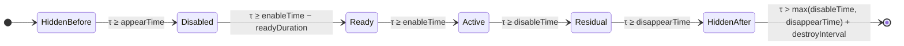

# BlockArea 状态类型与行为

本文档专门汇总**块的状态类型**（`BlockPhase`）以及**每种状态下块做什么**。
所有结论取自 `libil2cpp.so` 反汇编（`PreviewBlockControl`，VA 见各节），常数经 ELF 段逐字节校验。

> 相关：数据结构见 [`data.md`](./data)，完整变换/缓动见 [`behavior.md`](./behavior)，
> 等价 C# 见 [`code/PreviewBlockControl.decompiled.cs`](./code/PreviewBlockControl.decompiled.md)。

## 1 状态枚举 `BlockPhase`

`dump.cs` TypeDefIndex `4924`（嵌套于 `PreviewBlockControl`）：

| 值 | 名称 | 含义 |
| --- | --- | --- |
| `0` | `HiddenBefore` | 出现前 |
| `1` | `Disabled` | 已出现、尚未进入预警窗口 |
| `2` | `Ready` | 预警窗口（生效前） |
| `3` | `Active` | **生效**窗口 |
| `4` | `HiddenAfter` | 消失后 |

::: warning 枚举**不被缓存使用**
`PreviewBlockControl.lastPhase`（字段 `0x88`）**从未被任何方法读写**（全代码扫描无 `this+0x88` 访问）。
阶段不是状态机驱动的，而是**每帧按 `nowTime` 重算布尔**（`wasVisible` `0x8D` / `wasReady` `0x8E` /
`isDisabled` `0x8C`）得出的。`BlockPhase` 枚举因此只是「语义标签」。
:::

## 2 四个时间点

块的五段由 `blockInfo` 的四个绝对时刻切分（单位秒，`data.md`）：

```
appearTime ≤ enableTime < disableTime ≤ disappearTime
```

- `disabledBlockReadyDuration`（`0x5C`，实测 `0.5`）= `Ready` 窗口长度
- `disabledBlockShowDuration`（`0x58`，实测 `0.5`）= **仅**淡入时长（不是窗口长度）
- `destroyInterval`（`0x20`，实测 `5.0`）= 消失后的销毁延迟

## 3 状态时间线



> `Residual`（`disableTime ≤ τ < disappearTime`）**不是** `BlockPhase` 成员，是一个「已失效但可见」的过渡段。

## 4 各状态的条件与行为

`UpdateBlockActivation`（VA `0x1D707CC`）每帧重算：

```csharp
bool visible     = appearTime <= now && now < disappearTime;                 // w21
bool ready       = (enableTime - disabledBlockReadyDuration) <= now && now < enableTime; // w22
bool inWindow    = enableTime <= now && now < disableTime;                   // notInWindow 才是被存的
```

| 状态 | 时间条件 | 位置/可见 | 判定 (`IsActive`) | 外观 | layer | 一次性动作 |
| --- | --- | --- | --- | --- | --- | --- |
| `HiddenBefore` | `τ < appearTime` | 移到 `(1000,0,0)` 出画 | ✗ | 不可见 | 不变 | — |
| `Disabled` | `appearTime ≤ τ < enableTime − readyDuration` | 正常摆放 | ✗ | 显示；减块 α=0.1 | `disabledLayer` | 进入时 `DisabledBlockShow` 淡入 |
| `Ready` | `enableTime − readyDuration ≤ τ < enableTime` | 正常摆放 | ✗ | 预备态（呼吸脉冲，shader） | 先 `readyLayer`→ 延时后 `enabledLayer` | 进入时 `DisabledBlockReady` |
| `Active` | `enableTime ≤ τ < disableTime` | 正常摆放 | ✓ | 生效 | `enabledLayer` | — |
| `Residual`（非枚举） | `disableTime ≤ τ < disappearTime` | 正常摆放 | ✗ | 退回禁用外观 | `disabledLayer` | — |
| `HiddenAfter` | `τ ≥ disappearTime` | 移到 `(1000,0,0)` 出画 | ✗ | 不可见 | 不变 | `τ > max(disable,disappear)+5.0` 时 `Destroy` |

### 4.1 位置与可见性

`UpdateBlocksTransform`（VA `0x1D706C4`）每帧执行，`isDragging` 为真时跳过：

```csharp
if (appearTime > now || now >= disappearTime) {
    transform.localPosition = new Vector3(1000f, 0f, 0f);   // 出画
    return;
}
// 否则按 topRight/bottomLeft 百分比摆放
```

- **出画靠移位置，不靠关渲染**；layer 也不因隐藏而改变。
- 摆放：`center = (bl+tr)/2`（世界），`scale = (|tr.x−bl.x|, |tr.y−bl.y|, 1)`。

### 4.2 层切换（layer）

- `UpdateBlockActivation` **只在 `notInWindow`（即 `Active` 以外）时**把 layer 切到 `disabledLayer`
  （带 `isDisabled` 去抖）。
- `Ready` / `enabledLayer` 的赋值在 **`DisabledBlockReady` 协程**内完成：
  `NameToLayer(readyLayer)` → `WaitForSeconds(readyDuration)` → `NameToLayer(enabledLayer)`。
- **`Start`（VA `0x1D7060C`）只在 `isSubtract == true` 时才设置这三个 layer 名**；普通块保持 `null`。

### 4.3 颜色（`renderer.color`）

- `UpdateBlockActivation`：只改 `.a` —— `isSubtract ? 0.1 : 1.0`（`0.1` 在 `.rodata 0xC261F0`），RGB 恒 `(1,1,1)`。
- `DisabledBlockShow` 协程（VA `0x1D71F90`）在进入 `Disabled` 时按 `disabledBlockShowDuration`
  线性淡入颜色：
  - 普通块：`(1,1,1,0)`（`0xC26790`）→ `(1,1,1,1)`
  - 减块：`(1,0,1,0.1)`（`0xC26680`）→ `(1,1,1,0.1)`（`0xC26A60`）

### 4.4 判定（命中）

仅 `Active` 可被触摸：`IsActive(τ) = enableTime ≤ τ < disableTime`（VA `0x1D71C40`）。
命中测试为**裸半边 `0.5`** 的局部 AABB（无 inset），减块按**命中数奇偶**抵消普通块
（`JudgeControl`，见 [`behavior.md §5`](./behavior#_5-命中判定与触摸)）。

### 4.5 销毁

`DestroyAfterInterval`（VA `0x1D70B10`，`<Update>g__DestroyAfterInterval|16_0`）：

```csharp
if (now > Mathf.Max(disableTime, disappearTime) + destroyInterval)   // 5.0
    Destroy(gameObject);
```

即只有在 `HiddenAfter` 之后才销毁；届时 `IsActive=false`，触摸不会命中。

## 5 一次性协程（状态切换副作用）

| 协程 | 触发 | VA | 行为 |
| --- | --- | --- | --- |
| `DisabledBlockShow` | `visible && !wasVisible && !notInWindow` | `0x1D71F90` | 按 `0x58` 线性淡入颜色（见 §4.3） |
| `DisabledBlockReady` | `ready && !wasReady` | `0x1D71E34` | `readyLayer` → `WaitForSeconds(0x5C)` → `enabledLayer` |

::: tip 去抖字段
- `wasVisible`（`0x8D`）防 `DisabledBlockShow` 重播；
- `wasReady`（`0x8E`）防 `DisabledBlockReady` 重播；
- `isDisabled`（`0x8C`）防 layer 重复切换。
:::

## 6 一句话总结

块是一个**由四个绝对时间点切分的五态（+1 过渡段）对象**，每帧按 `nowTime` 重算状态；
位置用「移出画」表达隐藏，视角用 layer 切换，颜色用两段 alpha/淡入表达，
判定只在 `Active` 段成立，`HiddenAfter` 之后延时销毁。
