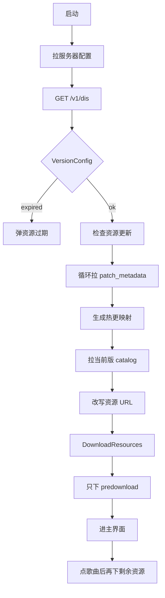

# Rizline 移动端资源获取

国服 Android 资源走 CDN + Unity Addressables。离线脚本见 [rizline-assets-get](https://github.com/CHCAT1320/rizline-assets-get) 根目录 `main.py`。

::: warning WARNING
本文只说明客户端/CDN 的资源拉取与解包流程，不保证接口长期可用。请勿二次分发官方资源。
:::

::: tip TIP
对照仓库：

- 流程说明：[`resource_download.md`](https://github.com/CHCAT1320/rizline-assets-get/blob/main/resource_download.md)
- 下载入口：[`main.py`](https://github.com/CHCAT1320/rizline-assets-get/blob/main/main.py)
- 解包：[`unpack/`](https://github.com/CHCAT1320/rizline-assets-get/tree/main/unpack)
:::

下文 `{base}` = `resourceBaseUrl`，`{ver}` = `resourceVersion`。实测日期 2026-09-19，客户端 `2.7.1`，`{ver}` = `v141_2_7_1_3c13bbff2bP`。

## 总览

游戏启动不会一次性下完 catalog 里所有远程文件。启动只保证 `predownload`；其余按歌曲 / 插画 / 谱面按需拉取。离线脚本则会尽量把 catalog 全部远程项拉完再解包。



APK 内几乎没有完整资源包。当前 APK `assets/aa/Android/` 通常只有 `crilocaldata_assets_all.bundle`；其余 bundle / acb 都在 CDN 的版本目录里。

## 脚本用法

仓库根目录：

```bash
pip install requests colorama UnityPy
python main.py
```

`.acb` 转 wav 需要 [vgmstream-cli](https://github.com/vgmstream/vgmstream)。Windows 可把可执行文件放到仓库 `vgmstream-cli/`；构建参考 [Virace/vgmstream-cli-build](https://github.com/Virace/vgmstream-cli-build)。

::: warning WARNING
清空 `./download` 会删掉已下的 bundle / acb。全量远程大约一千多个文件，确认后再选 `y`。
:::

脚本会询问是否清空 `./download`，再询问是否下载全部远程资源。下载完成后自动：

1. `parse_level()` 扫描 bundle，选出最新 `Default` 关卡表
2. `parse_catalog()` 解析 Addressables catalog
3. `export_all_resources()` 按关卡 / 分类导出到 `./output`

## 1. 版本配置 API

IL2CPP 入口：`GetServerConfig`、`PigeonSDKGameConfig`、`GameStart`。`GetServerConfig.Start()` 先 ping，再拉配置。脚本对应 `getRizlineVersion()`。

### 请求

```
GET https://rizserver.pigeongames.net/game/server_api/v1/dis
```

无 query、无 body。`Content-Length: 0`。

| 请求头 | 必填 | 值 | 说明 |
| --- | --- | --- | --- |
| `game_id` | 是 | `pigeongames.rizline` | 缺了 / 错了都是 `400 Invalid game_id` |
| `channel_id` | 否 | `11` | 国服渠道；不带头或改 `0` 现网正文相同 |
| `i18n` | 否 | `zh-CN` | 改 `en` / `ja` 现网 JSON 相同 |
| `host` | 自动 | `rizserver.pigeongames.net` | 客户端会显式带 |
| `user-agent` | 否 | `BestHTTP/2 v2.6.3` | 游戏用 BestHTTP |
| `accept-encoding` | 否 | `gzip, identity` | |

```python
import requests

DIS = "https://rizserver.pigeongames.net/game/server_api/v1/dis"
headers = {
    "game_id": "pigeongames.rizline",
    "channel_id": "11",
    "i18n": "zh-CN",
    "user-agent": "BestHTTP/2 v2.6.3",
}
resp = requests.get(DIS, headers=headers, timeout=20)
resp.raise_for_status()
data = resp.json()
```

成功时 `200`，`Content-Type: application/json; charset=utf-8`。

::: tip TIP
`game_id` 是唯一必填头。不带 `channel_id`、不带 `i18n`，只要 `game_id: pigeongames.rizline`，现网同样 `200`。
:::

::: warning WARNING
`game_id` 缺、空、写错都是 `400`，正文 `Invalid game_id`（`text/html`，不是 JSON）。`POST` 直接 `404`。
:::

### 返回字段

根对象对应 `ServerConfig`：

| 字段 | 类型 | 含义 |
| --- | --- | --- |
| `configs` | `VersionConfig[]` | 按客户端版本列出的配置，通常取 `[0]` |
| `minimalVersion` | `string` | 最低可进游戏的客户端版本 |
| `maintenanceInfo` | `object?` | 维护公告；维护时可能只有这一项，没有 `configs` |

`configs[]` 对应 `VersionConfig`：

| 字段 | 类型 | 含义 |
| --- | --- | --- |
| `version` | `string` | 客户端版本，如 `2.7.1` |
| `resourceUrl` | `string` | 当前资源目录，通常等于 `{resourceBaseUrl}/{resourceVersion}`，可为空串 |
| `resourceBaseUrl` | `string` | 资源根，国服现为 `https://rizlineasset.pigeongames.net/versions` |
| `resourceVersion` | `string` | 资源目录名，如 `v141_2_7_1_3c13bbff2bP`。末尾 `P` 表示热更版 |
| `platform` | `string?` | dump 里有，现网常省略 |
| `expired` | `bool?` | `true` 时弹资源过期，不能继续下 |
| `inReview` | `bool?` | 审核包配置 |
| `maintenanceInfo` | `object?` | 该版本自己的维护文案 |

`maintenanceInfo`：

| 字段 | 语言 |
| --- | --- |
| `zhHans` | 简中 |
| `zhHant` | 繁中 |
| `en` | 英文 |
| `ja` | 日文 |

旧格式（约 1.0.10–2.0.7）只有 `version` + `resourceUrl`，维护文案还带 `time`，正文里的 `{TIME}` 会被替换。更早则是根上的 `underMaintenance` / `maintenanceNotice*`。

### 解析

```python
if not data.get("configs"):
    raise ValueError("configs 为空，可能在维护或走了备份地址")
cfg = data["configs"][0]
if cfg.get("expired"):
    raise ValueError("资源已过期")
base = cfg["resourceBaseUrl"]
ver = cfg["resourceVersion"]
url = cfg.get("resourceUrl") or f"{base}/{ver}"
```

客户端用 `cfg["version"]` 对当前安装版本；对不上或 `expired` 就停。脚本只取 `version` / `resourceUrl` / `resourceBaseUrl` / `resourceVersion` / `minimalVersion`。

::: warning WARNING
`configs` 为空或只有 `maintenanceInfo` 时不要继续拼资源 URL。`expired=true` 客户端会弹资源过期。
:::

::: tip TIP
`resourceUrl` 一般等于 `{resourceBaseUrl}/{resourceVersion}`，但并不保证永远如此。解析时优先用这两个字段分别拼后续路径。
:::

### 实测 2026-09-19

正常返回：

```json
{
  "configs": [{
    "version": "2.7.1",
    "resourceUrl": "https://rizlineasset.pigeongames.net/versions/v141_2_7_1_3c13bbff2bP",
    "resourceBaseUrl": "https://rizlineasset.pigeongames.net/versions",
    "resourceVersion": "v141_2_7_1_3c13bbff2bP"
  }],
  "minimalVersion": "2.7.1"
}
```

响应头有 `etag`、`broadcast-expires: true`、`access-control-allow-origin: *`。

| 情况 | 结果 |
| --- | --- |
| 完整头 / 只带 `game_id` | `200`，正文相同 |
| 无 `game_id` / 空 / 错（如 `pigeongames.phigros`） | `400`，`text/html`，正文 `Invalid game_id` |
| `channel_id=0`、`i18n=en/ja` | `200`，和 `zh-CN` 相同 |
| `POST` | `404` HTML：`Cannot POST /server_api/v1/dis` |

### 备份 / 审核配置

不带头也能 GET。这不是启动主路径，内容也不一定是当前热更。

:::tabs
== 国服
| 用途 | URL | 实测 |
| --- | --- | --- |
| 备份 | `https://rizlineasset.pigeongames.net/configs/game_config_cn.json` | `200`，`configs: []` |
| 审核 | `https://rizlineasset.pigeongames.net/configs/review_config_cn_MfBdz4mYo8UpYGbG31LZ4Tey5AVPouMR.json` | `404` OSS `NoSuchKey` |
== 国际服
| 用途 | URL | 实测 |
| --- | --- | --- |
| 旧 config | `https://rizlineassetstore.pigeongames.cn/configs/game_config.json` | `200`，`configs: []` |
| 2.0.4+ `/v1/dis` + `game_id` | `https://service.rhyths.net/game/server_api/v1/dis` | `200`，`resourceBaseUrl` 为 `rizlineassetstore.../versions` |
| 同上无 `game_id` | 同上 | `400 Invalid game_id` |
| 审核 | `https://rizlineassetstore.pigeongames.cn/configs/review_config_SQ7Mpkop6M6ZDoOfYODOmYfeu1xto8ko.json` | 未作为启动路径 |
| 公开审核 | `https://rizlineassetstore.pigeongames.cn/configs/review_config_public.json` | 未作为启动路径 |
:::

备份 `configs` 为空，不能当现网 `{ver}` 用。要以 `/v1/dis` 为准。

::: warning WARNING
`game_config_cn.json` 等备份经常是空 `configs`，审核配置还可能 `404`。不要用它们当启动配置。
:::

## 2. 热更补丁链 API

类：`GameStart.LoadResourcePatches`、`LoadResourcePatchMetadata`。脚本对应 `getPatchMetadatas()` / `collect_patch_chain()`。

### 请求

```
GET {base}/{ver}/patch_metadata
```

无自定义头。CDN（OSS）直接给文件。`HEAD` 和 `GET` 都能 `200`。

```python
url = f"{base}/{ver}/patch_metadata"
resp = requests.get(url, timeout=20)
if resp.status_code != 200 or resp.text.lstrip().startswith(("<Error", "<?xml")):
    prev, files = None, []  # 链在这里断
else:
    lines = [ln.strip() for ln in resp.text.splitlines() if ln.strip()]
    prev, files = lines[0], lines[1:]
```

| 状态 | 含义 |
| --- | --- |
| `200` | 这一版是热更，正文是补丁表 |
| `404` | 这一版没有 metadata，链断在这里。**目录往往还在**，基线文件就放这儿 |

`200` 时 `Content-Type` 常是 `application/octet-stream`，不是 JSON。UTF-8，LF（`\n`），文件末尾也有换行。XML / `<Error>` 当失败。

::: warning WARNING
不要当 JSON 解析。OSS `404` 的 body 是 XML `<Error><Code>NoSuchKey</Code>...`，状态码和正文都要认。
:::

::: tip TIP
路径里不要加 `Android/`。正确是 `{base}/{ver}/patch_metadata`，写成 `{base}/{ver}/Android/patch_metadata` 会 `404`。
:::

### 正文结构

```
{上一版 resourceVersion}
Android/{hash}.bundle
Android/catalog_catalog.hash
Android/catalog_catalog.json
Android/cridata_assets_criaddressables/{name}.acb={checksum}
iOS/{hash}.bundle
...
```

| 行 | 含义 |
| --- | --- |
| 第 1 行 | 上一版 `{ver}`，后面当下一跳去拉 |
| 其余行 | **本版相对上一版改过的文件**。路径按字典序 |
| `Android/...` / `iOS/...` | 成对出现，内容不必完全同一组 hash |
| `catalog_catalog.json` / `.hash` | catalog 本身也算热更文件 |
| `cridata_assets_criaddressables/*.acb=*` | 热更音频，**没有**末尾 `.bundle` |

国服脚本只收 `Android/`，并跳过 `catalog_catalog.json` / `catalog_catalog.hash`：

```python
SKIP = {"catalog_catalog.json", "catalog_catalog.hash"}
android = [
    ln for ln in files
    if ln.startswith("Android/") and ln.split("/", 1)[-1] not in SKIP
]
```

### 链怎么走

从当前 `{ver}` 开始：

1. `GET {base}/{ver}/patch_metadata`
2. `200`：本版 `files` 全部记进 `resourcePatchMap[path] = ver`（已有的不覆盖，所以保留**最后写入 / 最新**的那一版）；`ver = 第 1 行 prev`，继续
3. `404` 或正文无效：停。最后一次成功 metadata 里的 prev 就是 `resourceBaseVersion`

不是「还能拉到 metadata 的最旧版」，是「最后一份成功表写下的 prev」。404 的那一版目录仍可能完整存在。

::: warning WARNING
`patch_metadata` 404 ≠ 该版本目录不存在。基线 bundle / acb 往往就在这个 404 的 `{ver}` 下面。
:::

::: tip TIP
`resourceVersion` 末尾带 `P` 的是热更版，会有 `patch_metadata`。基线目录通常不带 `P`，例如现网 `v138_2_7_0_d9b31649c6`。
:::

`resourcePatchMap`：相对路径 → 最后一次出现在 `files[]` 里的版本。catalog 远程项对不上任何一版 `files[]` 的，走基线目录。

静态字段：`resourceBaseUrl`、`resourceBaseVersion`、`resourcePatchMap`、`internalIdURLMap`。

### 实测 2026-09-19

| 请求 | 状态 | 结果 |
| --- | --- | --- |
| `.../v141_...P/patch_metadata` | `200` | prev=`v140_...P`，Android 21 / iOS 21（bundle 17 + catalog×2 + acb 2） |
| `.../v140_...P/patch_metadata` | `200` | prev=`v139_...P`，Android 7（bundle 5 + catalog×2） |
| `.../v139_...P/patch_metadata` | `200` | prev=`v138_2_7_0_d9b31649c6`，Android 30（bundle 26 + catalog×2 + acb 2） |
| `.../v138_2_7_0_d9b31649c6/patch_metadata` | `404` | 链终点，`resourceBaseVersion = v138_...` |
| 假版本 / 空版本 / `{ver}/Android/patch_metadata` | `404` | OSS `NoSuchKey` |
| 对 v141 `HEAD` | `200` | 文件存在 |

所以现网基线目录是 `v138_2_7_0_d9b31649c6`（无末尾 `P`）。

## 3. Catalog API

```
GET {base}/{当前ver}/Android/catalog_catalog.json
GET {base}/{当前ver}/Android/catalog_catalog.hash
```

iOS 把路径里的 `Android` 换成 `iOS`。无自定义头。catalog 必须从**当前 ver**拉，不要用基线目录里可能过期的那份。

```python
catalog = requests.get(
    f"{base}/{ver}/Android/catalog_catalog.json", timeout=60
).json()
catalog_hash = requests.get(
    f"{base}/{ver}/Android/catalog_catalog.hash", timeout=20
).text.strip()
```

`200`，JSON。这是 Unity Addressables `ContentCatalogData`。APK 里还有 `assets/aa/catalog.json`，运行时以 CDN 当前版为准。`.hash` 用来判断 catalog 要不要更新，和 JSON 里的 `m_BuildResultHash` **不是**同一个值。

::: warning WARNING
catalog 必须从**当前** `{ver}` 拉。基线目录里的 `catalog_catalog.json` 也能 `200`，但是旧表，对不上当前热更文件。
:::

::: tip TIP
必须带平台目录：`Android/` 或 `iOS/`。少这一层，或写成 `StandaloneWindows64/`，都是 `404`。
:::

### JSON 顶层

| 字段 | 类型 | 含义 |
| --- | --- | --- |
| `m_LocatorId` | `string` | 一般是 `AddressablesMainContentCatalog` |
| `m_BuildResultHash` | `string` | catalog 构建 hash，和 `.hash` 文件不是同一个 |
| `m_InstanceProviderData` / `m_SceneProviderData` | `object` | Provider：`m_Id`、`m_ObjectType`、`m_Data` |
| `m_ResourceProviderData` | `array` | 全部 ResourceProvider |
| `m_ProviderIds` | `string[]` | 如 `AssetBundleProvider` |
| `m_InternalIds` | `string[]` | 资源内部 ID 表，下载只关心这里的 `http://` 项 |
| `m_KeyDataString` | `string` | Base64，key 二进制 |
| `m_BucketDataString` | `string` | Base64，bucket 二进制 |
| `m_EntryDataString` | `string` | Base64，entry 二进制 |
| `m_ExtraDataString` | `string` | Base64，下载选项等 |
| `m_resourceTypes` | `array` | `{ m_AssemblyName, m_ClassName }`，注意这个字段是小写 r |
| `m_InternalIdPrefixes` | `array` | 现网常为空 |

### 实测 2026-09-19

v141 `m_LocatorId` = `AddressablesMainContentCatalog`，`m_BuildResultHash` = `deb7b24656391e54b21a2a0430144df6`，`.hash` 文件 = `e4ff79cb97ddf7a7edc01bd29e7a62ab`。

| 请求 | 状态 | 说明 |
| --- | --- | --- |
| `{ver}/Android/catalog_catalog.json` | `200` | 约 380 KB，`m_InternalIds` 3052 条、无重复 |
| `{ver}/iOS/catalog_catalog.json` | `200` | 同样 3052 条 |
| `{ver}/Android/catalog_catalog.hash` | `200` | 32 位 hex 文本 |
| `{resourceBaseVersion}/Android/catalog_catalog.json` | `200` | 基线目录里也有，但是旧 catalog，不要用 |
| `{ver}/catalog_catalog.json`（无平台目录） | `404` | |
| `{ver}/StandaloneWindows64/catalog_catalog.json` | `404` | PC 不走这套 CDN |

### `m_InternalIds` 分类

v141 共 3052 条、无重复：

| 形态 | 条数 | 要不要下 CDN |
| --- | --- | --- |
| `http://.../*.bundle` | 1331 | 要，远程 bundle |
| `http://.../*.acb=...` | 158 | 要，远程音频 |
| 32 位 hex | 1330 | 否，内部 id |
| `Assets/` 等本地路径 | 159 | 否 |
| `{UnityEngine.AddressableAssets.Addressables.RuntimePath}/...` | 1 | APK 内 `crilocaldata` |
| 其它逻辑名 | 73 | 否，如 `ApplicationVariables` |

远程项一律是占位前缀，**这个主机不能访问**（HEAD 502 / 断连）：

```
http://rizastcdn.pigeongames.cn/default/Android/{hash}.bundle
http://rizastcdn.pigeongames.cn/default/Android/cridata_assets_criaddressables/{name}.acb={checksum}.bundle
```

真实主机是 `{base}`。加载后由 `InternalIdTransformFunc` 改写。

::: warning WARNING
`http://rizastcdn.pigeongames.cn/default/` 只是 catalog 占位前缀，实测 `HEAD` 为 `502`。直接请求会失败。
:::

脚本剥前缀得到相对路径；若含 `.acb=` 且以 `.bundle` 结尾，再去掉末尾 `.bundle`，否则音频 404。

```python
PLACEHOLDER = "http://rizastcdn.pigeongames.cn/default"

def catalog_relative_path(internal_id: str) -> str:
    rel = internal_id
    if rel.startswith(PLACEHOLDER + "/"):
        rel = rel[len(PLACEHOLDER) + 1 :]
    if ".acb=" in rel and rel.endswith(".bundle"):
        rel = rel[: -len(".bundle")]
    return rel
# bundle: Android/{hash}.bundle
# acb:    Android/cridata_assets_criaddressables/{name}.acb={checksum}
```

### key → bundle 映射

`m_KeyDataString` / `m_BucketDataString` / `m_EntryDataString` 都是小端二进制，Base64 后塞进 JSON。解包用 `parse_unity_catalog()`：

1. **Key**：`uint32 count`，然后每条 `uint8 type` + 内容。`0` UTF-8 长度字符串，`1` UTF-16LE 长度字符串，`4` int32
2. **Bucket**：`uint32 count`，每条 `key_offset` + `entry_count` + `entry_index[]`
3. **Entry**：定长 28 字节 × 7 个 int32：`internalId` / `provider` / `depBucket` / `crc` / `extra` / `siblings` / `type`
4. 把 bucket 的 key 和 entry 的依赖 / InternalId 对上，得到 `chart.xxx` → `abcd....bundle`

`build_bundle_map()` 只留 value 以 `.bundle` 结尾的项。

## 4. 资源 URL 拼法

客户端对每个 InternalId：

1. 已在 `internalIdURLMap` → 用缓存 URL
2. 去掉 `http://rizastcdn.pigeongames.cn/default/`
3. 相对路径在 `resourcePatchMap` → `{base}/{mappedVer}/{相对路径}`
4. **不在 map 里（基线）** → `{base}/{resourceBaseVersion}/{相对路径}`

游戏不会从新到旧试 404。基线一次指向链终点那个完整目录。离线脚本会先试 mapped / 基线，失败再扫历史版本，用来兜 CDN 个别缺文件。

```python
def resolve_file_version(rel_path: str, patch_map: dict, base_version: str) -> str:
    for key in (rel_path, rel_path.removesuffix(".bundle"), rel_path + ".bundle"):
        if key in patch_map:
            return patch_map[key]
    return base_version

def build_download_url(base: str, version: str, rel_path: str) -> str:
    return f"{base}/{version}/{rel_path}"
```

| 文件 | 方法 | URL |
| --- | --- | --- |
| 版本配置 | `GET` | `https://rizserver.pigeongames.net/game/server_api/v1/dis` |
| 补丁表 | `GET` | `{base}/{ver}/patch_metadata` |
| Catalog | `GET` | `{base}/{当前ver}/Android/catalog_catalog.json` |
| Catalog hash | `GET` | `{base}/{当前ver}/Android/catalog_catalog.hash` |
| 热更 bundle | `GET` | `{base}/{最后写入它的 ver}/Android/{hash}.bundle` |
| 基线 bundle | `GET` | `{base}/{链终点 prev}/Android/{hash}.bundle` |
| 热更 / 基线音频 | `GET` | `{base}/{对应 ver}/Android/cridata_assets_criaddressables/{name}.acb={checksum}` |

音频必须保留 `cridata_assets_criaddressables/`，并且**去掉** catalog 末尾的 `.bundle`。带 `.bundle` 或少子目录都是 404。

::: warning WARNING
catalog 里的 acb InternalId 带末尾 `.bundle`，CDN 上的真实路径没有。热更文件只存在写入它的那一版；基线文件放当前 ver 会 `404`。
:::

::: tip TIP
游戏不会从新到旧试版本。命中 `resourcePatchMap` 用 mapped ver，否则一次指向 `resourceBaseVersion`。
:::

bundle / acb 都是无鉴权 `GET`/`HEAD`，响应体就是文件。脚本按 URL 末段存到 `download/bundles/` 或 `download/acb/`。

### 实测 2026-09-19

以 v141 热更文件 `Android/1bed5685....bundle`、热更 acb `ヘーブンリースカイ....acb=3225e0`、基线 `Android/00108990....bundle` 为例：

| 情况 | 状态 | 说明 |
| --- | --- | --- |
| 热更 bundle 放当前 ver | `200` | 约 95 MB |
| 同一热更 bundle 放基线 v138 | `404` | 只活在写入它的那一版 |
| 热更 acb 去掉 `.bundle`、保留子目录 | `200` | 约 3.2 MB |
| 热更 acb 仍带 catalog 的 `.bundle` | `404` | |
| 热更 acb 去掉 `cridata_assets_criaddressables/` | `404` | |
| catalog 占位主机 `rizastcdn.../default/...` | `502` | 不能直接下 |
| 基线 bundle 放当前 ver | `404` | |
| 基线 bundle 放 `resourceBaseVersion`（v138） | `200` | 42407 字节 |

## 5. 启动下载 vs 按需下载

`GameStart.DownloadResources(isRetry)`：

1. key：`predownload`、`predownload_` + i18n（如 `predownload_zh-CN`）
2. `GetDownloadSizeAsync` 算差量
3. `Addressables.DownloadDependenciesAsync(key)`

`LoadOver()` 后进主界面。点歌曲 / 插画 / 谱面再 `LoadAssetAsync`，按改写后的 URL 拉剩余文件。

离线脚本会把 catalog 全部远程 `http` 项尽量全部拉完，再额外并入热更链里出现过、但当前 catalog 未列出的路径。

::: tip TIP
启动只下 `predownload` / `predownload_zh-CN`。谱面、HiRes 曲绘、歌曲 acb 都是点进对应界面才拉。
:::

## 6. 解包

下载目录：

```
download/
├── catalog_catalog.json
├── fileList.json          # catalog key → bundle 映射
├── bundles/*.bundle
└── acb/*.acb
```

### 关卡表

扫描全部 bundle 的 `MonoBehaviour`，找出名为 `Default` 的 typetree。候选按来源 bundle 更新时间、是否末曲 `temp`、关卡数、谱面数、`activityTime` 排序，自动写成 `output/default.json`。

关卡来源是 `levels` + `discOLevels`。

### Catalog 映射

`parse_unity_catalog()` 解码 `m_KeyDataString` / `m_BucketDataString` / `m_EntryDataString`，得到 key → InternalId。`build_bundle_map()` 只保留 value 以 `.bundle` 结尾的项。

### 分类导出

按 catalog key 前缀分类：

| key 前缀 | 类型 | 输出 |
| --- | --- | --- |
| `chart.` | 谱面 TextAsset | `charts/.../*.json` |
| `chart.challenge.` | 挑战谱面 | `charts/challenge/` |
| `illustration.` | 曲绘 | `illustrations/`，含 `.HiRes` / `.cn` |
| `altIllustration.` | 替代曲绘 | `alt_illustrations/` |
| `layout.` | 铺面背景 | `layouts/` |
| `seriesBanner.` / `seriesPoster.` | 系列图 | `series/banners`、`series/posters` |
| `avatar.` | 头像 | `avatars/` |
| `banner.` | 活动 Banner | `banners/` |
| `banner.bannerList` | Banner 配置 | `banners/bannerList.json` |
| `local.` / `predownload_` | 本地化 | `localization/` |
| `D00` | 视频 | `videos/` |
| `Assets/Rizline/`、`Assets/Le Tai` | UI | `ui/` |

谱面 key 可能带 `.mr` / `.cn` 分段，会进对应子目录。`.mat` / `.prefab` 跳过。

每个关卡会先导出到 `output/charts/<discName>/<歌曲名>/`：谱面 json、曲绘（含 HiRes / cn）、`chartInfo.json`，以及用 vgmstream 转出的 wav。catalog 里已随关卡导出的谱面不会再重复放到分类目录。未进关卡的 acb 转到 `output/audio/`。

## 7. 输出结构

```
output/
├── default.json
├── charts/<Disc>/<歌曲>/
│   ├── chart.<id>.<diff>.json
│   ├── illustration.<id>.png
│   ├── <musicId>.wav
│   └── chartInfo.json
├── illustrations/
├── alt_illustrations/
├── layouts/
├── series/
├── avatars/
├── banners/
├── localization/
├── videos/
├── ui/
└── audio/
```

谱面 json 格式见 [Rizline谱面格式说明](../rizline.md)。

## 8. 关键类

| 类 | 作用 |
| --- | --- |
| `PigeonSDKGameConfig` | 配置 URL 常量 |
| `ServerConfig` / `VersionConfig` | 版本 JSON |
| `GetServerConfig` | 启动拉配置 |
| `GameStart` | 补丁链、catalog、predownload |
| `GameStart.ResourcePatchMetadata` | `version` + `files` |
| `Addressables.DownloadDependenciesAsync` | 按 key 下依赖 |

字符串：`server_api/v1/dis`、`/patch_metadata`、`predownload`、`predownload_`、`http://rizastcdn.pigeongames.cn/default/`、`game-resource-expired`、`game-resource-ver`。

## 与 PC 的区别

:::tabs key:platform
== 移动端
- 从 CDN 下 bundle / acb，bundle **不加密**
- catalog：`{base}/{ver}/Android/catalog_catalog.json`
- 音频：`.acb` + vgmstream
- 需要网络
- 文档：[资源](./assets.md) / [存档](./save.md)
== PC
- 解本地安装目录，bundle **AES-256-CBC**
- catalog：`StreamingAssets/aa/catalog.json`
- 音频：bundle 内 `AudioClip`
- 不需要网络
- 文档：[资源](../pc/assets.md) / [存档](../pc/save.md)
:::
