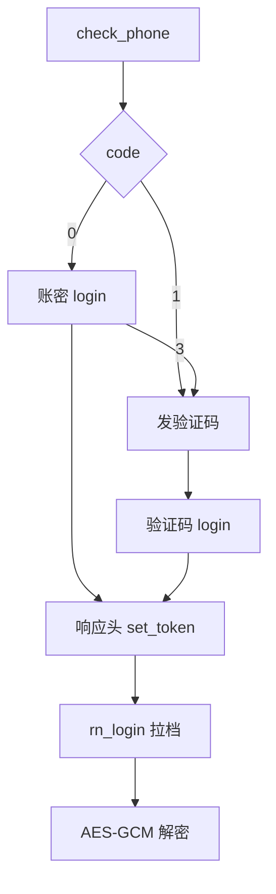

# Rizline 移动端存档

国服云存档走账号服 + AES-256-GCM。离线脚本见 [RizlineGameSaveData](https://github.com/CHCAT1320/RizlineGameSaveData)。

::: warning WARNING
只可用于查分。不要短信轰炸、频繁拉档或做不利于鸽游的事。该项目与鸽游无关。
:::

::: tip TIP
对照仓库：

- 入口：[`getUser.py`](https://github.com/CHCAT1320/RizlineGameSaveData/blob/main/getUser.py)
- 解密：[`gameDataAes2Json.py`](https://github.com/CHCAT1320/RizlineGameSaveData/blob/main/gameDataAes2Json.py)
- 字段：[`API.md`](https://github.com/CHCAT1320/RizlineGameSaveData/blob/main/API.md)
:::

基址 `https://rizserver.pigeongames.net`。除特别说明外都是 `POST` + JSON。暂不支持国际服邮箱登录。

## 总览



## 脚本用法

```bash
python getUser.py
```

首次无 token 时输入手机号 / 密码（空密码走验证码）。成功后只把 `device_id`、`channel_id`、`token` 写入 `config.json`，不保存手机号和密码。明文存档写到 `gameData.json`。

::: warning WARNING
`config.json` / `gameData.json` 含 token 和成绩，不要提交仓库。
:::

token 失效时脚本会清掉本地 token 并重新登录。

## 加解密

旧云存档是 AES-256-CBC。当前国服是 **AES-256-GCM**，旧 CBC 脚本会解失败。

HTTP body 多为 `application/octet-stream` 原始字节：

```
nonce(12) || ciphertext || tag(16)
```

密钥不直接明文存放，而是两段静态数组 `_m0` / `_p0` 经 `Unfold` 还原：

1. 按 `_p0` 把 `_m0` 以 4 字节块重排
2. 滚动 XOR：`out[i] ^= (salt + 7 * (i >> 2))`，每字节 `salt += 13`，salt 初值 `0xA7`

还原后是 32 字节 ASCII 的 AES-256 key。响应头 `sign` 是 Ed25519，不是 AES 密文。

商店等接口有时直接返回 JSON，解密函数会先试 GCM，失败再当明文。

::: tip TIP
`/game/rn_login` 解开后**没有** `{code,data}` 包一层，直接是用户文档。其它游戏接口解开后一般是 `{"code":0,"data":...}`。
:::

## 公共请求头

| 头 | 必填 | 含义 |
| --- | --- | --- |
| `game_id` | 是 | `pigeongames.rizline` |
| `device_id` | 是 | 本机 UUID，同一设备保持不变 |
| `channel_id` | 是 | `"1"`～`"11"`（账号接口要带；和资源 CDN 的 `/v1/dis` 不同） |
| `i18n` | 建议 | 国服 `zh-CN` |
| `phone` | 拉档后是 | 登录手机号 |
| `token` | 拉档后是 | 登录响应头 `set_token` |
| `Content-Type` | POST JSON 时 | `application/json` |

```python
import requests
import uuid

BASE = "https://rizserver.pigeongames.net"
headers = {
    "game_id": "pigeongames.rizline",
    "device_id": str(uuid.uuid4()),
    "channel_id": "11",
    "i18n": "zh-CN",
    "Content-Type": "application/json",
}
```

::: warning WARNING
`401` 正文 `Expired` 不一定是 JWT 过期。用已保存 token 时也要从 JWT 带上 `phone`，缺了同样 `Expired`。
:::

::: tip TIP
资源接口 `/game/server_api/v1/dis` 可以不带 `channel_id`。账号 / 存档接口要带。
:::

## 登录

### `POST /account/check_phone`

| 字段 | 含义 |
| --- | --- |
| `phone` | 手机号 |

明文 JSON：`code == 0` 可账密，`code == 1` 必须验证码。

### `POST /account/send_verify_code`

| 字段 | 含义 |
| --- | --- |
| `phone` | 手机号 |
| `transaction` | 登录填 `login` |

::: warning WARNING
不要频繁打这个接口。验证码大约 2 分钟有效。
:::

### `POST /account/login`

账密：`{"phone","password"}`。验证码：`{"phone","code"}`。

| body `code` | 含义 |
| --- | --- |
| `0` | 成功，看响应头 `set_token` |
| `3` | 账密被拒，改验证码 |
| 其它 | 失败，看 `msg` |

`set_token` 是 JWT。之后所有 `/game/` 请求都要把它放进请求头 `token`。

### JWT

标准三段：`header.payload.signature`，用 `.` 分隔。中间段是 Base64URL 的 JSON（缺 `=` 补齐后再解）。脚本只读 payload，不验签。

```python
import base64
import json

def decode_jwt_payload(token: str) -> dict:
    payload = token.split(".")[1]
    payload += "=" * ((-len(payload)) % 4)
    return json.loads(base64.urlsafe_b64decode(payload))
```

payload 字段：

| 字段 | 类型 | 含义 |
| --- | --- | --- |
| `userId` | string | 对外用户 id，和存档 / 响应头 `user-id` 相同 |
| `phone` | string | 登录手机号。后续请求头 `phone` 必须带这个，否则 `401 Expired` |
| `gameId` | string | 固定 `pigeongames.rizline` |
| `channelId` | string / number | 登录时的渠道 |
| `iat` | number | 签发时间，Unix 秒 |
| `exp` | number | 过期时间，Unix 秒。大约签发后 **7 天** |

典型形态（号码打码）：

```json
{
  "userId": "xxxxxxxxxxxxxxxxxxxxxxxx",
  "phone": "138****0000",
  "gameId": "pigeongames.rizline",
  "channelId": "11",
  "iat": 1758240000,
  "exp": 1758844800
}
```

`config.json` 只存整段 token，不存手机号。再用 token 拉档时要从 payload 取出 `phone` 填回请求头：

```python
payload = decode_jwt_payload(token)
headers["token"] = token
headers["phone"] = str(payload["phone"])
```

::: warning WARNING
`exp` 过了会 `401 Expired`。没过期但请求头缺 `phone`，同样是 `401` 正文 `Expired`。不要把整段 JWT 提交仓库。
:::

::: tip TIP
`phone`、`userId` 都在 payload 里，明文可读。签名在第三段，查分脚本不校验。
:::

:::tabs variant:code
== 账密
```python
check = requests.post(
    f"{BASE}/account/check_phone",
    json={"phone": phone},
    headers=headers,
)
login = requests.post(
    f"{BASE}/account/login",
    json={"phone": phone, "password": password},
    headers=headers,
)
if login.json().get("code") == 3:
    raise RuntimeError("改走验证码")
token = login.headers["set_token"]
headers["token"] = token
headers["phone"] = phone
```
== 验证码
```python
requests.post(
    f"{BASE}/account/send_verify_code",
    json={"phone": phone, "transaction": "login"},
    headers=headers,
)
login = requests.post(
    f"{BASE}/account/login",
    json={"phone": phone, "code": sms},
    headers=headers,
)
token = login.headers["set_token"]
headers["token"] = token
headers["phone"] = phone
```
:::

注册 / 改密 / 换绑以及商店、邮件、周任务等其它接口见 [移动端其它 API](./api.md)。

## 拉档 `POST /game/rn_login`

请求 `{}`。成功 body 是 GCM 密文，解开后直接是用户文档。

| 字段 | 含义 |
| --- | --- |
| `_id` | 数据库文档 id |
| `userId` | 对外用户 id（JWT 里也是它） |
| `username` | 昵称 |
| `coin` / `dot` | 金币 / 点券 |
| `totalRks` | 总 RKS |
| `userBatch` | 用户批次 |
| `rizcard` | 当前名片 |
| `myBest` | 各谱最好成绩 |
| `levelsRks` | 计入总分的单谱 RKS |
| `unlockedLevels` | 已解锁曲目 id |
| `appearLevels` | 选曲界面出现过的曲目 |
| `getItems` | 背包：签名 / 排版 / 模组 / 插画 |
| `getOwnProducts` | 已购商城商品及次数 |
| `getProducts` | 商城货架 |
| `getOwnAchievements` | 已获成就和时间 |
| `ownRizcards` | 交换名片 + 静态名片 + 已读数 |
| `mails` / `mailSyncId` | 邮件和同步游标 |
| `challenge` / `challengeProgress` | 课题定义 / 是否已通 |
| `features` | 功能开关，常为空 |

`rizcard`：`avatarPos{x,y,z}` 头像裁剪；`avatarId` 头像插画；`bioId1/bioId2` 两条称号；`backgroundId` 背景；`layoutId` 排版；`createTime` 创建时间。

`myBest[]`：

| 字段 | 含义 |
| --- | --- |
| `trackAssetId` | 曲目 id |
| `difficultyClassName` | `EZ` / `HD` / `IN` / `AT` |
| `score` | 分数 |
| `completeRate` | 完成率（百分数，可 >100） |
| `isFullCombo` / `isClear` | FC / 通关 |

::: tip TIP
`levelId` 形如 `DBirth.Sakuzyo.0`。谱面 Addressable 是 `chart.<levelId>.<EZ|HD|IN|AT>`。和 [PC 存档](../pc/save.md) 的 `bestScore:` key 是同一套 id。
:::

## HTTP 层

| 情况 | 结果 |
| --- | --- |
| 成功游戏接口 | `200`，body 常为 GCM 字节 |
| token / `phone` 头不对 | `401`，正文 `Expired` |
| 路由不存在 | HTML `Cannot POST /xxx` |
| 账号接口失败 | 明文 JSON，`code != 0` + `msg` |

其它接口的逐条实测见 [移动端其它 API](./api.md)。PC 本地 `.sav` 见 [PC 端存档](../pc/save.md)。
