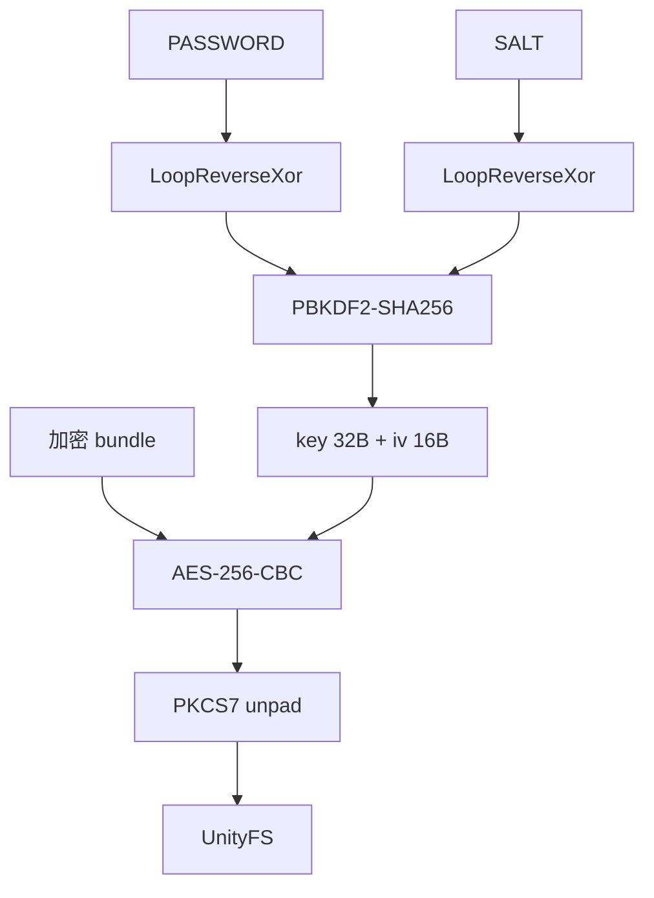

# Rizline PC 端资源获取

PC（StandaloneWindows64）资源在安装目录里，不走移动端 CDN。解包脚本见 [rizline-assets-get](https://github.com/CHCAT1320/rizline-assets-get) 的 [`pc/pc_unpack.py`](https://github.com/CHCAT1320/rizline-assets-get/blob/main/pc/pc_unpack.py)。

::: warning WARNING
PC 的 `*.bundle` 整份 AES-256-CBC 加密。key / iv 由客户端硬编码常量推导，社区脚本可复现，本身不是强加密。请勿二次分发官方资源。
:::

::: tip TIP
这是 PC 独立工具，和仓库根目录的 Android 下载脚本 `main.py` 互不影响。PC 音频是 bundle 内 `AudioClip`，不需要 vgmstream。
:::

## 需要的东西

从 PC 版游戏目录找到数据目录（一般叫 `Rizline_Data`，里面还有一层同名目录）：

```
Rizline_Data/
└── Rizline_Data/
    └── StreamingAssets/
        └── aa/
            ├── catalog.json
            └── StandaloneWindows64/
                ├── *.bundle
                └── ...
```

## 用法

```
pip install UnityPy pycryptodome
```

默认会去 `pc/Rizline_Data/Rizline_Data` 找资源，也可以直接指定：

:::tabs variant:code
== 数据目录
```bash
python pc/pc_unpack.py --game-data "D:/Rizline/Rizline_Data/Rizline_Data"
```
== 分别指定
```bash
python pc/pc_unpack.py --bundle-dir "D:/.../StreamingAssets/aa/StandaloneWindows64" \
                       --catalog    "D:/.../StreamingAssets/aa/catalog.json"
```
== 自定义输出
```bash
python pc/pc_unpack.py --game-data "D:/..." --out pc/output
```
== 全量扫描
```bash
python pc/pc_unpack.py --game-data "D:/..." --scan-all
```
:::

| 参数 | 说明 | 默认 |
| --- | --- | --- |
| `--game-data` | 含 `StreamingAssets/aa` 的数据目录 | `pc/Rizline_Data/Rizline_Data` |
| `--bundle-dir` | 直接指定 `*.bundle` 目录，覆盖 `--game-data` | - |
| `--catalog` | 直接指定 `catalog.json`，覆盖 `--game-data` | - |
| `--out` | 输出目录 | `pc/output` |
| `--scan-max-bytes` | 扫描 `Default` 表时允许的最大 bundle 体积 | `1000000` |
| `--scan-all` | 扫描全部 bundle 找 `Default` 表 | 关 |

扫不到 `Default` 表时再加 `--scan-all`。

## 流程

1. 用硬编码常量派生 AES-256 key / iv
2. 解析 `catalog.json`，得到 key → bundle 映射
3. 解密并扫描较小 bundle，找出名为 `Default` 且含 `levels` 的 MonoBehaviour
4. 合并多张表的 `levels` / `discOLevels` / `musics` / `illustrations` / `charts`
5. 按 Disc 导出谱面、曲绘、音频
6. 把未被关卡引用的 catalog 资源丢进 `other/`

## 解密原理

每个 `*.bundle` 都是**整份文件**加密：没有文件头、没有随机 nonce、没有存 salt / iv。key 和 iv 完全由代码里的两组常量推导，因此解密是确定性的。



### 常量

```python
PASSWORD = b"+rK3cH@3\txH|CR;b2\x00IP%O&w=j\r\n>N%sgQ1y"   # 36 字节
SALT     = bytes.fromhex("a76eb2f6ff88d70a74999ee77d762730")  # 16 字节
```

两者都是硬编码。直接放明文太显眼，所以先做一层 `LoopReverseXor` 混淆。

### LoopReverseXor

对每个字节 `i`：

```
out[i] = bitrev(in[i]) XOR in[(i + 1) % n]
```

`bitrev` 把 8 个二进制位左右颠倒。最后一个字节回绕和第一个字节异或。这一步可逆，只用来藏常量，不提供密码学强度。

### PBKDF2

```python
dk = hashlib.pbkdf2_hmac(
    "sha256",
    loop_reverse_xor(PASSWORD),
    loop_reverse_xor(SALT),
    3000,
    48,
)
key, iv = dk[:32], dk[32:]
```

前 32 字节 = AES-256 key，后 16 字节 = CBC iv。输入固定，**每个文件的 key / iv 都相同**。

### AES-256-CBC

密文必须是 16 的整数倍。解密后按 PKCS#7 去填充。明文以 `UnityFS` 开头，再交给 `UnityPy.load()`。

入口：`derive_key_iv()` → `decrypt_bundle()` → `Extractor.env()`。

## 输出结构

```
pc/output/
├── meta/            Default.json 等原始表 + lookup.json
├── charts/<Disc>/<歌名 [曲师]>/
│   ├── meta.json    该曲的关卡/曲绘/谱面合并信息
│   ├── cover.png    曲绘（优先 HiRes）
│   ├── audio.wav    音频（非 wav 则为 .bin）
│   └── <难度>.json  谱面
├── covers/<Disc>/   曲绘副本
├── audio/<Disc>/    音频副本
├── other/           未被关卡引用的 catalog 资源
│   ├── chart/
│   ├── illustration/
│   ├── altIllustration/
│   └── music/
└── index.json       统计、缺失清单、按 id 索引
```

谱面 json 格式见 [Rizline谱面格式说明](../rizline.md)。

关卡目录优先导出 `illustrationId.HiRes`，没有再退回普通曲绘，再试 `altIllustration.<levelId>`。音频 key 为 `music.<musicId>`，从 `AudioClip.samples` 取；RIFF 头写成 `.wav`，否则 `.bin`。

## 与移动端的区别

:::tabs key:platform
== 移动端
- 从 CDN 下 bundle / acb，bundle **不加密**
- catalog：`{base}/{ver}/Android/catalog_catalog.json`
- 音频：`.acb` + vgmstream
- 需要网络
- 文档：[资源](../mobile/assets.md) / [存档](../mobile/save.md)
== PC
- 解本地安装目录，bundle **AES-256-CBC**
- catalog：`StreamingAssets/aa/catalog.json`
- 音频：bundle 内 `AudioClip`
- 不需要网络
- 文档：[资源](./assets.md) / [存档](./save.md)
:::
