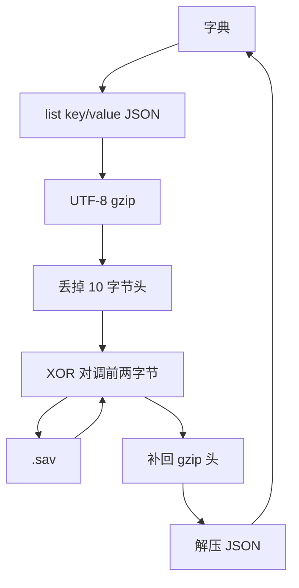

# Rizline PC 端存档

游戏没有对存档做 AES。磁盘上的 `.sav` 是 **UTF-8 JSON → gzip → 丢掉 10 字节头 → 前两字节与第 3 字节 XOR 对调**。内存里始终是 `Dictionary<string, string>`。

对应代码：`SaveSystem` / `SaveSystem.SaveData`（`dump.cs` TypeDef 5107–5122）。

::: warning WARNING
不是加密。XOR 只打乱 gzip 头，密钥就是文件第 3 字节自己。改 `record.sav` 不会自动发 Steam 成就；云存档冲突以 Steam Cloud 时间为准。
:::

::: tip TIP
对照样本与解包脚本见 [RizlineGameSaveData](https://github.com/CHCAT1320/RizlineGameSaveData) 之外的 PC 存档工具（`save_io.py` / `unpack_saves.py`）。移动端云存档是另一套 AES-GCM，见 [移动端存档](../mobile/save.md)。
:::

## 位置

正式包：

```
%USERPROFILE%\AppData\LocalLow\PigeonGames\Rizline\
```

`GetSaveFilePath` 实际是：

```
Application.persistentDataPath / domain.ToString().ToLower()
```

Steam Cloud 同步时文件名带 `.sav` 后缀。

| 文件 | Domain | 用途 |
| --- | --- | --- |
| `config.sav` | Config = 0 | 设置、选曲、Mods |
| `record.sav` | Record = 1 | 官谱成绩、badge |
| `workshop.sav` | Workshop = 3 | 工坊选曲与成绩 |
| `favorite.sav` | Favorite = 2 | 收藏（可能没有） |
| `steam_autocloud.vdf` | Steam | 云存档账号，不是游戏存档 |

## 读写流程



:::tabs
== 写入
1. 字典转成 `List<SerializableKeyValuePair>`（`key` / `value`）。
2. `JsonUtility.ToJson` 包一层：

```json
{"list":[{"key":"settings.speed","value":"6.5"},{"key":"Mods.AutoPlay","value":"True"}]}
```

3. UTF-8 后 gzip。
4. 丢掉 10 字节头（`1F 8B 08 00 00 00 00 00 00 0A`）。
5. XOR 对调前两字节（读写同一套）：

```python
a = buf[1] ^ buf[2]
c = buf[0] ^ buf[2]
buf[0] = a
buf[1] = c
```

落盘不是完整 gzip，头像乱码（如 `c9 c8 5d 4f ...`）。
== 读取
1. 同样的 XOR 对调（对合，再做一次即还原）。
2. 前面补回 `1F 8B 08 00 00 00 00 00 00 0A`。
3. 当 gzip 解压，得到 JSON。
4. `JsonUtility.FromJson` 还原 `list[]`，填回字典。
:::

::: tip TIP
`JsonUtility` 不序列化 `Dictionary`，所以必须走 `list` + `{key,value}`。回写 gzip 的 `mtime` / 压缩级别不必与游戏逐字节相同，Load 只要求能当 gzip 解出来。
:::

### 运行时 API

```
SaveSystem.Config / Record / Favorite / Workshop
  .Int[key] / .Float[key] / .Bool[key] / .Date[key]
  [key]                 # string
  Get / Set / Delete
SaveSystem.DeleteAll()
```

`Set` 只改内存并标 dirty；后台 `SaveService` 把脏域写盘。值在磁盘上全是字符串：bool 为 `"True"` / `"False"`，数字为十进制文本，复杂对象再套一层 JSON。

## 解包

```python
from pathlib import Path
from save_io import unpack, pack

data = unpack(Path("save/config.sav").read_bytes())
data["settings.speed"] = "7"
Path("save/config.sav").write_bytes(pack(data))
```

`unpack()` 按任意 list 字段解析，不依赖外层一定叫 `list`。回写时使用 `{"list":[...]}`。

磁盘上每个 value 都是字符串。解包脚本常会把能 `json.loads` 的再解一层：

- 普通设置仍是字符串或数字：`"True"`、`6.5`、`2560`
- 成绩变成对象：`bestScore:...` → `BestScore`
- 工坊成绩变成对象：`record:<id>` → 带 `maxHit` / `maxScore`

`levelId` 形如 `DBirth.Sakuzyo.0` = 曲名标识.曲师标识.版本号，对应曲目表 `levels[].id` / `musics[].id`。谱面 Addressable 是 `chart.<levelId>.<EZ|HD|IN|AT>`。

## config.sav — 设置与选曲

这是进选曲界面时要恢复的 UI 状态，**不是成绩**。改这里只影响下次打开游戏时停在哪、开了哪些模组。

### 选曲位置

| Key | 类型 | 说明 |
| --- | --- | --- |
| `SelectedDiscName` | string | 当前碟片。与 `Default.levels[].discName` 一致：`Disc 1`、`Disc 2`、`EX - T.S.`、`EX - Single`。`Disc O` 是隐藏关 |
| `SelectedLevelId_<碟片名>` | string | **每个碟各自记住**上次点到哪一首 |
| `SelectedLevelId_All` | string | 「全部曲目」列表的光标，和分碟光标独立 |
| `lastDifficultyIndex` | int | EZ=0、HD=1、IN=2、AT=3 |
| `lastOrderingId` | string | 选曲排序。`name` = 按曲名 |

样本光标：

| Key | 值 |
| --- | --- |
| `SelectedLevelId_Disc 1` | `Empire.416.0` |
| `SelectedLevelId_Disc 2` | `AbsolutionPulse.nmy.0` |
| `SelectedLevelId_EX - T.S.` | `DBirth.Sakuzyo.0` |
| `SelectedLevelId_Disc O` | `Bamboo.rissyuu.1` |

::: warning WARNING
Disc O 的 `Bamboo.rissyuu.1` 后缀是 `.1`，和主表 `Bamboo.rissyuu.0` 不是同一条资源。
:::

### 画面与窗口

| Key | 说明 |
| --- | --- |
| `settings.resolutionWidth` / `Height` | 分辨率 |
| `settings.windowX` / `windowY` | 窗口左上角。`0,0` 一般是全屏或贴齐主屏 |
| `settings.language` | `SettingsControl.LanguageType`。`0` = 尚未写过或默认槽 |

代码里还有但常没写出的：`settings.vsync`、`settings.masterVolume`、`settings.musicVolume`、`settings.hitFXVolume`、`settings.uiSEVolume`、`settings.offset`。没出现 = 从未改过，读档时走默认值。

### 游玩设置

| Key | 说明 |
| --- | --- |
| `settings.speed` | 谱面流速 |
| `settings.scoreDisplayLeft` / `Right` | 左右信息条。`0 Star / 1 Combo / 2 ScoreUp / 3 ScoreDown / 4 AccUp / 5 AccDown / 6 Detail` |
| `settings.judgeOffsetBar` | 判定偏移条 |
| `settings.detailJudgeEnable` | 详细判定 |
| `settings.ingameParticleOneShot` / `Loop` | 一次性 / 循环粒子 |

未出现的相关 key：`settings.detailJudgeIndex`、`settings.moreToAuto`、`settings.judgeCalculatorTitle`。

### Mods

全是 `SaveSystem.Config.Bool` / `Int`。bool 磁盘值为 `"True"` / `"False"`。

| Key | 说明 |
| --- | --- |
| `Mods.AutoPlay` | 自动播放 |
| `Mods.NoFail` | 存档有此 key；运行时字段是 Mirror / LifeBar / NoBad / Border / Hide / AutoPlay / FreeHold。NoFail 多半是旧 key 或血条残留 |
| `Mods.NoBad` | 去掉 Bad |
| `Mods.FreeHold` | Hold 不用按满 |
| `Mods.LifeBarMode` | int。`0` 默认血条 |

未出现（改过才会写盘）：`Mods.Mirror`、`Mods.HideHealthBar`、`Mods.BorderHealthBar`。`BorderHealthBar` 在代码里是 **int**，不是 bool。

### 挑战

| Key | 说明 |
| --- | --- |
| `challenge.nowLevel` | 当前挑战关 id。`Default.challengeLevelHints[].id` 从 `1001` 起 |

其它 `challenge.*`（`beginChallenge`、`retry`、`rookieTitleN` 等）是 UI 文案 key，不进存档。

## record.sav — 官谱成绩

只存「最好一次」和少量解锁标记。key 用 `chart.<levelId>.<难度>`，和 Addressable 谱面 id 相同。

### `bestScore:chart.<levelId>.<diff>`

值为 `BestScore` 的 JSON（`dump.cs` TypeDef 5012）：

| 字段 | 类型 | 含义 |
| --- | --- | --- |
| `trackAssetId` | string | 曲目 id，等于 `<levelId>` |
| `difficultyClassName` | string | `EZ` / `HD` / `IN` / `AT` |
| `score` | int | 分数。官谱满贯附近约 `1000000+` |
| `completeRate` | float | 完成率，**可以 >100**（精确判定加成） |
| `isFullCombo` | bool | 全连 |
| `isClear` | bool | 是否过关，和分数不是一回事 |
| `hit` / `bad` / `miss` | int | 判定统计 |

`BestScore.Update(LevelDifference)` 只在更好时覆盖。空成绩是 `BestScore.Empty`。

::: warning WARNING
不要只看 `score`。可以出现 `score=0` 但 `completeRate` 很高、`hit=0` 的残缺记录（预览 / 自动 / 没正式结算）。
:::

样本 9 条 IN：

| 曲 | score | completeRate | hit/bad/miss | isClear |
| --- | --- | --- | --- | --- |
| Avataar…Scarlette | 1019369 | 103.63% | 1013 / 5 / 29 | true |
| Crimsonate | 1017988 | 116.44% | 862 / 0 / 6 | true |
| DBirth | 1007188 | 107.57% | 1030 / 4 / 22 | true |
| Encrux | 676113 | 61.60% | 501 / 3 / 240 | false |
| CrushAlcohol | 495518 | 43.53% | 608 / 6 / 619 | false |
| Antikythera | 174413 | 14.77% | 349 / 3 / 1652 | false |
| Planetarium… | 83612 | 3.70% | 75 / 2 / 822 | false |
| Souten…MeineMeinung | **0** | 85.12% | 0 / 0 / 0 | false |
| Sthenno | **0** | 87.56% | 0 / 0 / 0 | false |

### `badge:clearAllDisc1:<levelId>`

过关相关徽章。`1` = 已点亮。`clearAllDisc1` 表示 Disc 1 维度的清除标记。代码里还有 `badge:bestNoob:` 前缀，样本没有。

### `status.challengeOpened`

`True` = 已经进过挑战模式。和 config 里的 `challenge.nowLevel` 分工：这边是「开没开过」，那边是「打到第几关」。

## workshop.sav — Steam 工坊

官谱用字符串 `levelId`，工坊用 **Steam publishedfileid / 内部 ulong**。

| Key | 说明 |
| --- | --- |
| `onFavTab` | 是否停在收藏 tab |
| `selectedLevelId` | 当前选中的工坊关卡数字 id |
| `record:<id>` | 该工坊图的最好成绩 |

::: tip TIP
`selectedLevelId` 和 `record:` 后面的数字可以不是同一个：一个是光标，一个是打过的图。
:::

工坊成绩比官谱 `BestScore` 多 `maxHit` / `maxScore`，少曲名 / 难度：

| 字段 | 说明 |
| --- | --- |
| `score` | 分数。`0` 但有 hit/miss = 没按官谱计分规则结算，或中途退出 |
| `completeRate` | 完成率 |
| `isFullCombo` / `isClear` | |
| `hit` / `bad` / `miss` | |
| `maxHit` | 这张谱总物量 |
| `maxScore` | 理论满分 |

样本：`hit + miss = maxHit` 且 `bad=0`，说明每个 note 都进了 hit 或 miss。

## favorite.sav — 收藏

Domain = 2。`WorkshopLevelListControl.ReloadAll` 用 `SaveSystem.Favorite.GetAll(...)` 取出 key，再 `ulong.Parse` 成工坊文件 id。因此收藏是 **工坊数字 id 列表**，不是官谱 `levelId`。

`workshop.sav` 的 `onFavTab` 只记住「当前是否停在收藏页」。没有 `favorite.sav` 说明收藏为空或未同步。

## 没出现的 key 不等于 0

`SaveSystem.Get` 对缺失 key 返回默认值，**不会为了默认值写盘**。

::: warning WARNING
config 没有 `settings.masterVolume` → 用代码默认音量，不是静音。record 没有某首的 `bestScore:` → 没打过，读出来是 `BestScore.Empty`。
:::

`SettingsControl` 启动时会把当前设置写回 Config；只改过的项才会出现在 `.sav` 里。样本 config 26 条 = 这台机改过 / 用过的设置，不是完整设置表。

`steam_autocloud.vdf` 的 `accountid` 是 Steam 账号，和谱面 / 成绩无关。
